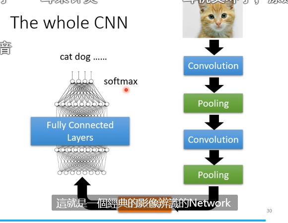

图片：长宽和GRB的channel 三维

receptive field都对应一个集合的神经元

一般做法：channel全部考虑 一般概率3x3的kernal size

stride移动那个kernal的位置超出影响的范围，那就padding补充依一些，设为0就可以了

共享参数，比如weight相同

filter就是一组共用参数，然后扫过整张图片

限制参数数量来限制弹性，弹性过大会过拟合

max pooling就是把图片变小，主要是为了减少运算量

