要用到贝叶斯定理 

高斯分布和极大似然

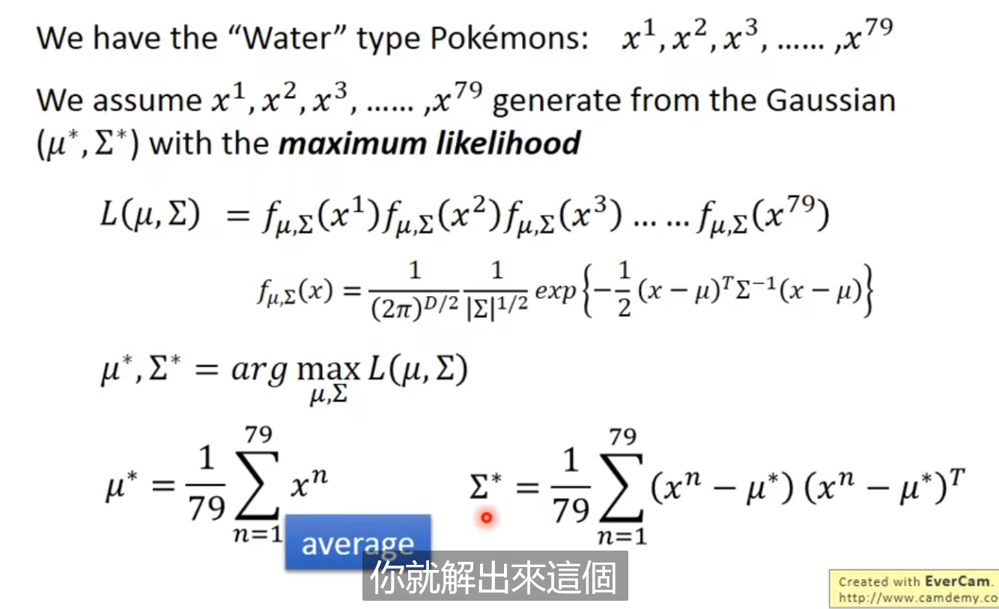

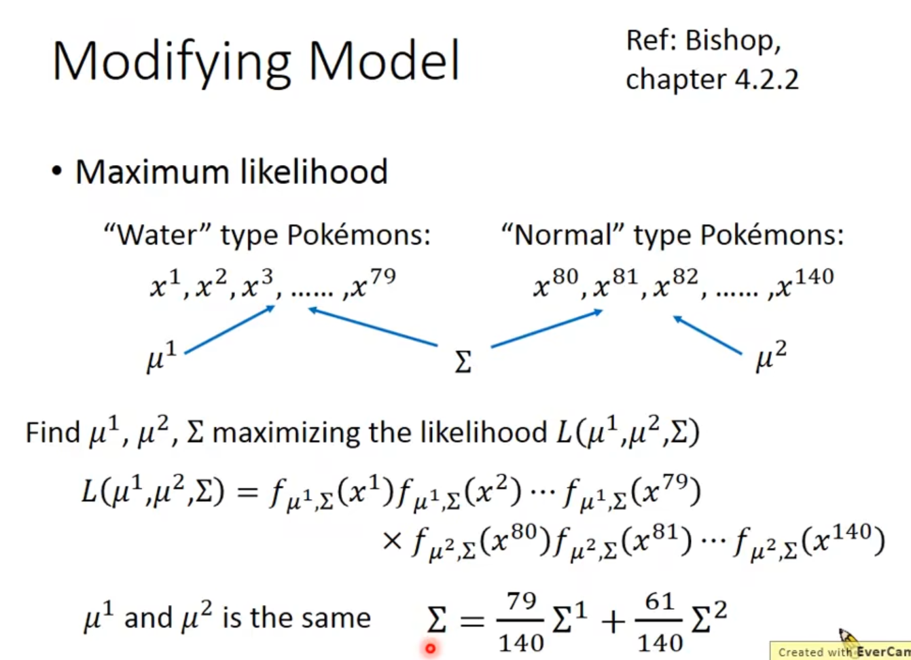

共用一个covariance

分界线是一个线性

朴素贝叶斯

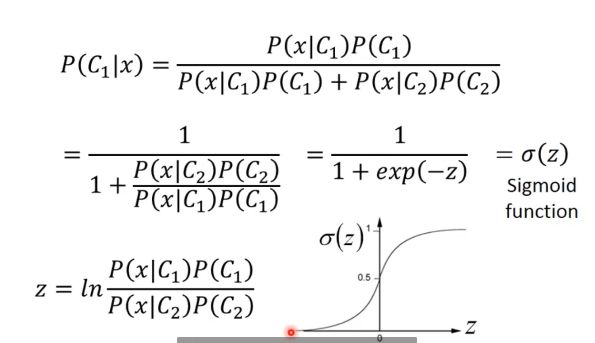

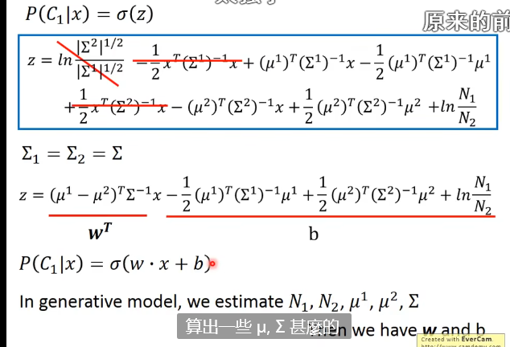

这就是回归

逻辑回归

交叉熵

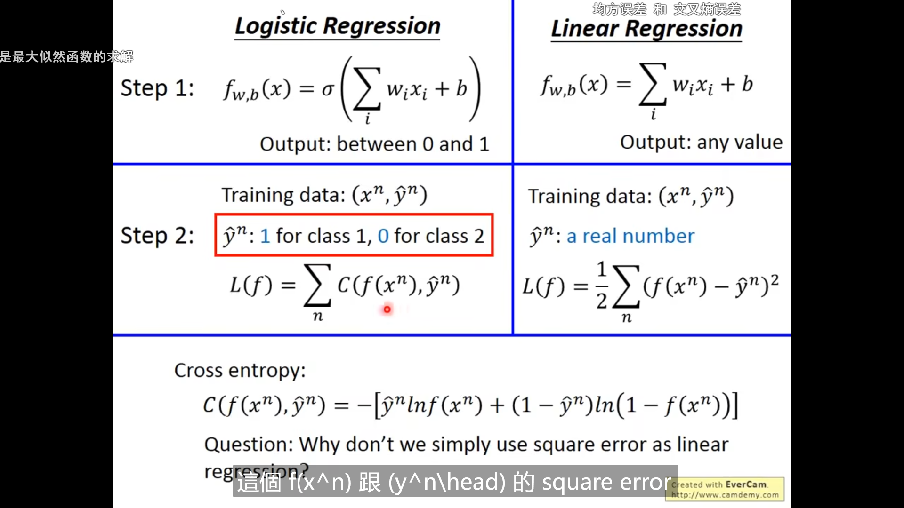

step2都是minimize

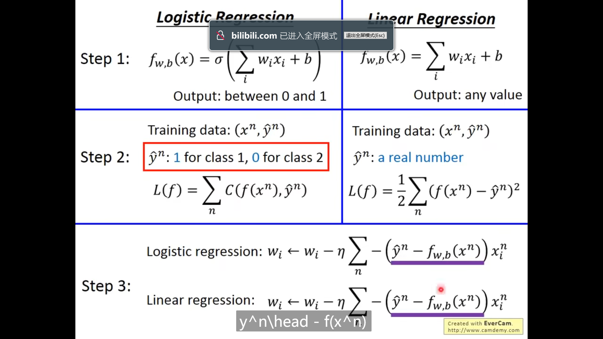

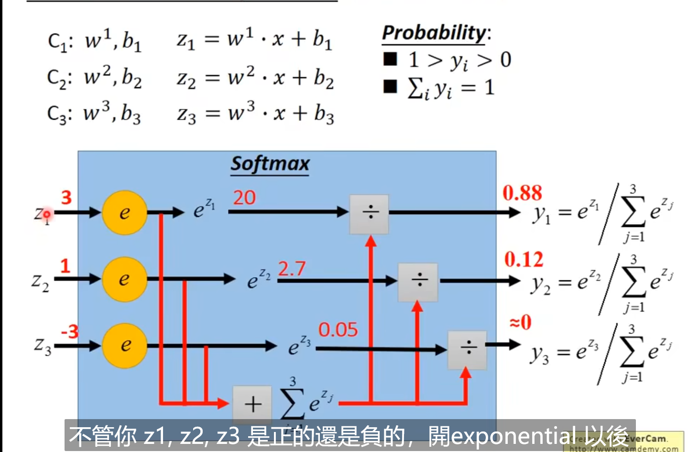

将大的值和小的值拉的更开

如果不行吧，可以做transformation

但是这个转换我们想用机器算出来，我们就可以用神经网络、

**调batch的大小可以跳出局部最小值**

**momentum也可以用来跳出不好的微分为0的点**

**就是利用前一个的动量和现在的梯度矢量合成一个新的方向**

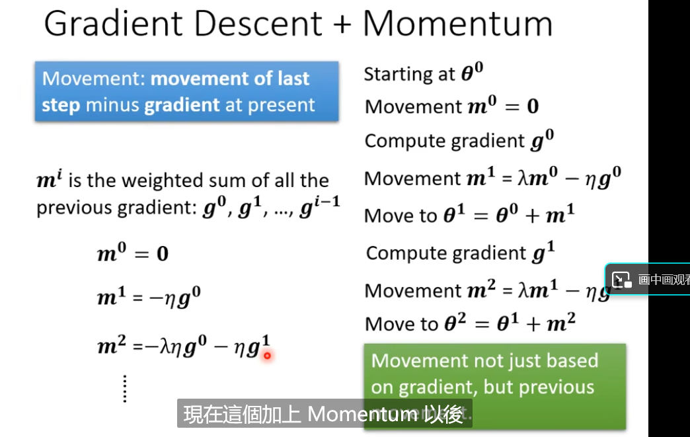

这个方法感觉和惯性的方法相似

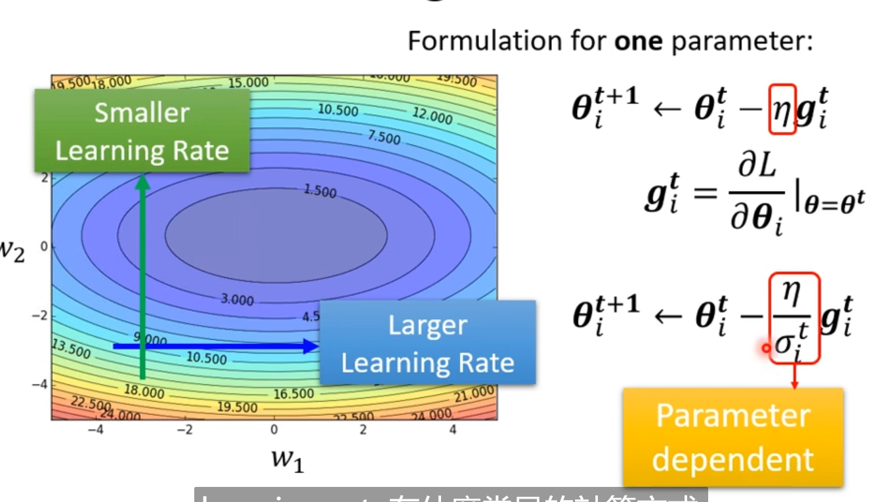

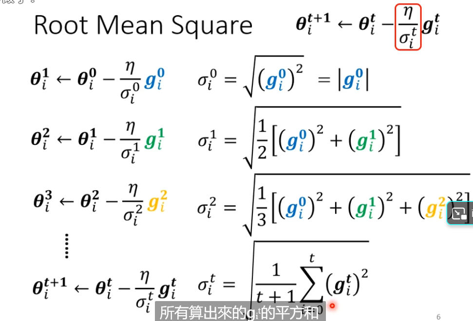

自动调整learning rate

 新的方法

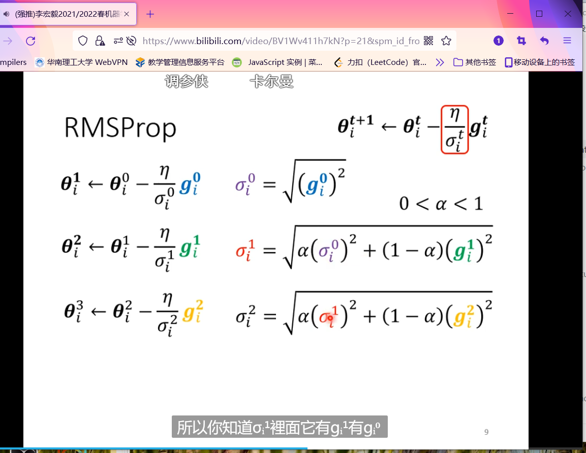

Adam

把learning rate设为与时间有关的参数

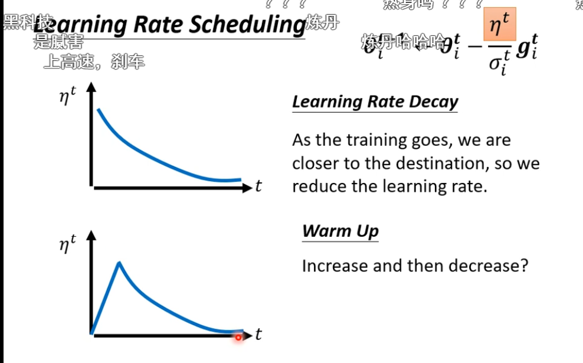

用向量表示分类，第几类那个位置就为1，其他为0、

得到的y是一个向量然后softmax

batch optimization  用feature normalization 

有一种feature normalization 叫做归一化，数模上有

new_x =（old_x - mean)/标准差 

这个当batch size比较大的时候好用

