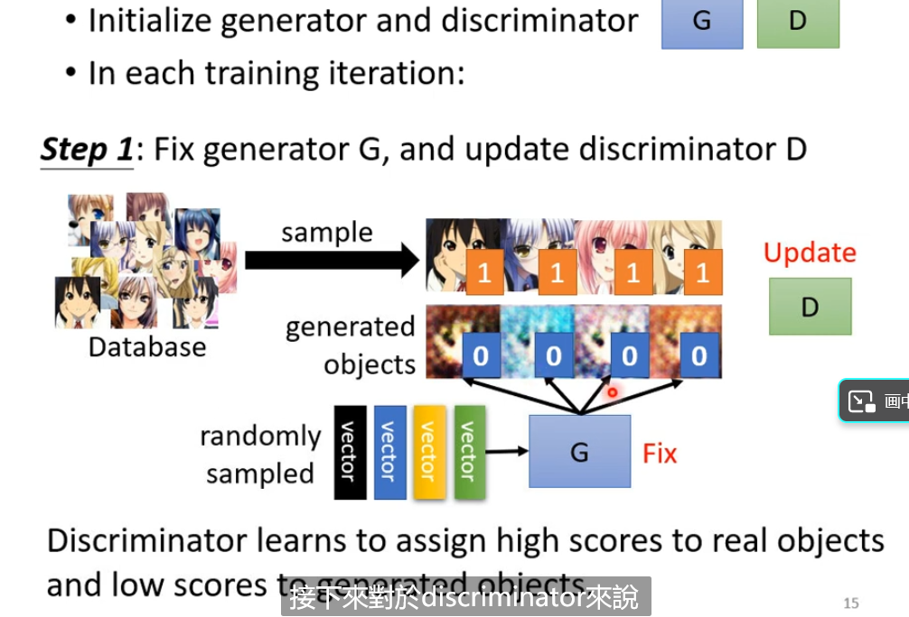
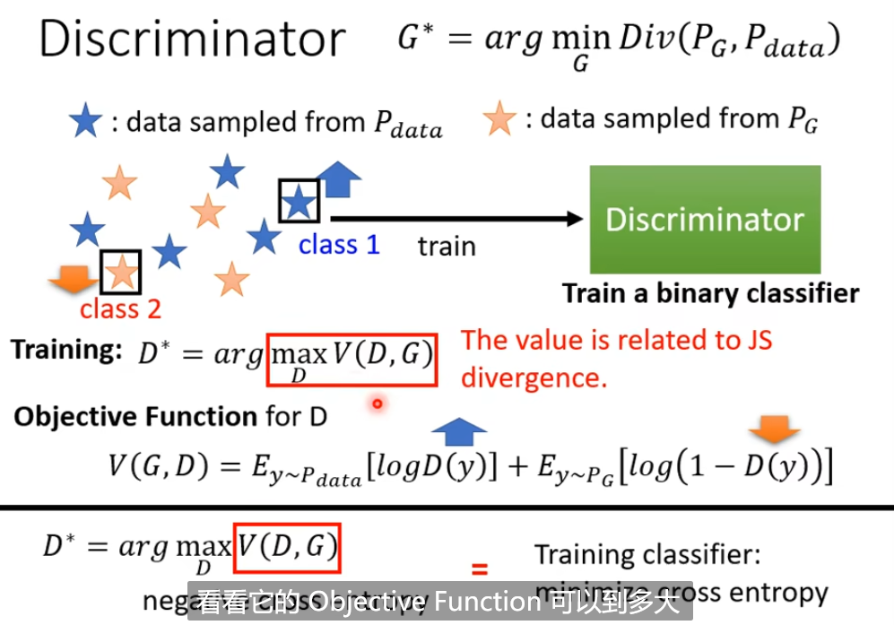
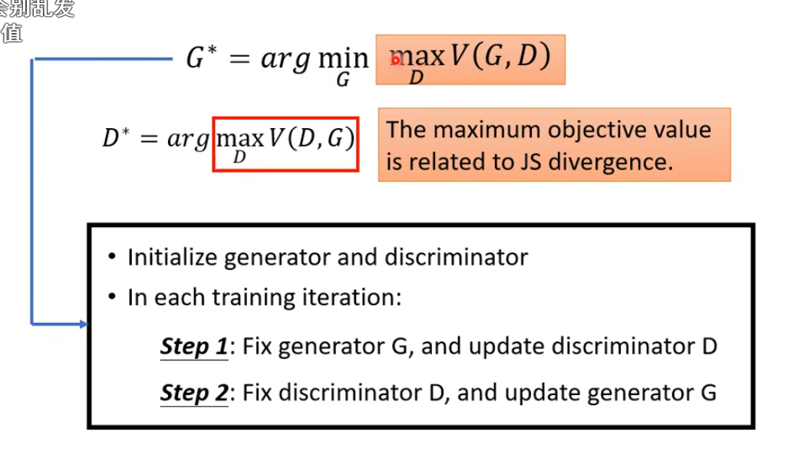

加上一个分布，概率

# GAN

## basic idea

generator和discriminator类似对抗的关系

可以当作分类或者回归的问题

第二步就是调节生成器的参数，让discriminator的分数越大越好

**总的来说就是固定一个，训练另外一个。**然后不断循环

# Progressive GAN

Divergence就是两个分布之间的差距

在这里我们希望P~G~和P~data~越像越好

如何计算这个呢？

这个max的值与divergence有关

Wasserstein distance

# SNGAN

