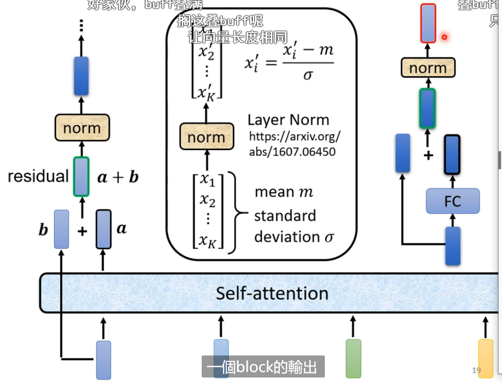

sequence to sequence 

NLP可以看作QA问题

# Encoder

用的是self-attention

有一种架构就是residual network，就是把输入和输出加在一起，然后再用layer normalization

下面是一个block的输入和输出

# decoder

## AT

会有一个softmax

why masked，变化的self-attention，每一个输出只看左边而不是全部

会有begin和end

