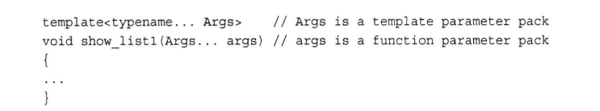
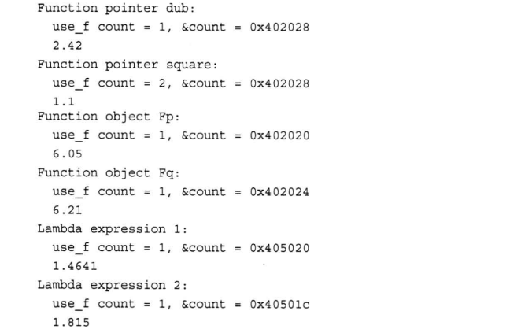

内存对齐

内存布局的最一开始是vfptr(virtual function ptr)即虚函数表指针(只要含虚函数，一定有虚函数表指针，而且该指针一定位于类内存
模型最前端)
接下来是Base类的成员变量，按照在类里的声明顺序排列，当然啦，
还是要像上面一样注意内存对齐原则


头文件没有拓展名的一般需要命名空间

endl确保程序继续运行前刷新输出（即其立即显示在屏幕上）而'\n'不能有这样的保证。这意味着有些系统中，又是可能在您输入信息后才会出现提示。

赋值是从右到左进行

cout必须将整数形式的数字转换为字符串形式。不过可以自行转换 

```
#include<> 去include目录找
#include""现在当前工作目录 注意是工作目录找 可以在工作目录中的inlcude中找，再去标准include目录找
```

std::endl 除了写 '\n' 进外，还调用 flush 函数，刷新缓冲区，把缓冲区里的数据写入文件或屏幕.考虑效率就用 '\n'。

```
//关于为什么
namespace std _GLIBCXX_VISIBILITY(default){}
会多一个_GLIBCXX_VISIBILITY(default)

下面一个例子
#define aaa
namspace ll aaa
{
}//这样不会报错的
相当于替换为空
```


声明与定义

1.声明用来告诉编译器变量的名称和类型，而不分配内存

2.定义是为了给变量分配内存，可以为变量赋初值

全局变量或静态变量初始值为0，局部变量初始化为随机值。

3.变量/函数可以声明多次，变量/函数的定义只能一次。

```c++
extern int var;//声明  在别的文件声明了
extern int b=10;//定义
typedef int INT;//声明
struct Node;//声明

int val;//声明+定义
struct node{//声明+定义
    int a;
    int b;
}

int max(int x);//声明
int max()//定义，给函数分配内存
{
}
```


c++程序的模块叫函数

数据类型大小

- short至少16位
- int至少和short一样大
- long至少32位，至少和int一样长
- long long至少64,至少和long一样长

short == short int

long == long int


```
int a(12);//c++的另一种赋值
int num{2};
int num={2};
int num={};//0

```

unsigned == unsigned int


wchar_t  宽字符类型 存储unicode

char本质是整数 cin字符的时候，将字符转为整型 cout的时候，整型再转为字符

```
\b  退格 让光标向前
\r
\v 和 \t
```

转义字符可以用字符的八进制和十六进制编码代替

```
cout<<"\0xla";//十六
cout<<"\032";
```

通用字符名的用法类似转移序列

\u后面是八个十六进制

\U后面是十六个十六进制位

signed char和unsigned char

```c++
char ch;  //may be signed, may not
unsigned char ch;
signed char;
```


cin和cout看作char流

对于wchar_t

```c++
wchar_t bob = L'p';
wcout<<L"tall";
```

char16_t;

char32_t;

使用浮点类型可以表示诸如 2.5 3.14159 和 122442.32这样的数即带小数部分的数字。计算机将这样的值分成两部分存储。一部分表示值，另一部分用于对值进行放大或缩小。下面打个比方。对于数字34.1245 和 34124.5它们除了小数点的位置不同外其他都是相同的。可以把第一个数表示为 0.341245(基准值)和100(缩放因子)而第二个数表为 0.341245(基准值同 10000（缩放因子更大） 缩放因子的作用是移动小数点的位置，术语浮点因此而得名。C++内部表示浮点数的方法与此相同，只不过它基于的是二进制数，因此缩放因子是2 的幂，不是 10 的幂。幸运的是，程序员不必详细了解内部表示。重要的是，浮点数能够表示小数值、非常大和非常小的值，它们的内部表示方法与整数有天壤之别。


```
2.25e+8
```

事实上,C和C++对于有效位数的要求是,float 至少32 位,double 至少48 位，且不少于 at, long double至少和 double 一样多。这三种类型的有效位数可以一样多。然而，通常，float 为32 位，double 为64位,long double 为 8096 或128位另外,这3 种类型的指数范围至少是-37 到 37。


对于同等级优先级操作符，看结合性。

浮点常量默认情况下是double


潜在转换问题

- double->float **有效数位**（精度）降低，值可能超过目标类型的取值范围，结果将不确定
- 浮点到整型。小数部分丢失，原来的值可能超出目标类型的取值范围，结果将不确定
- 大整型转小整型。原来的值可能超出目标类型的取值范围，通常只复制右边的字节

C++11 将使用大括号的初始化称为列表初始化 (list-initialization)，因为这种初始化常用于给复杂的数据类型提供值列表。与程序清单 13.3 所示的初始化方式相比，它对类型转换的要求更严格。具体地说，列表初始化不允许缩窄(narrowing)，即变量的类型可能无法表示赋给它的值。例如，不允许将浮点型转换为整型。在不同的整型之间转换或将整型转换为浮点型可能被允许，条件是编译器知道目标变量能够正确地存储赋给它的值。例如，可将 long 变量初始化为 int 值，因为 long 总是至少与 int 一样长;相反方向的转换也可能被允许，只要 int 变量能够存储赋给它的 long 常量:

表达式中转换

```c++
short a = 20;
short b = 20;
short c = a+b;//获得a和b，转为int最后在转为short
```

还有其他一些整型提升:如果 short 比 int 短，则unsigmed short 类型将被转换为nt; 如果两种类型的长度相同，则unsigned short类型将被转换为 unsignedint。这种规则确保了在对unsigned short 进行提升时不会损失数据。

同样，wchar t 被提升成为下列类型中第一个宽度足够存储 wchar t取值范围的类型:nt、unsigned intlong或unsigned long.

将不同类型进行算术运算时，也会进行一些转换，例如将 int 和 fat 相加时。当运算涉及两种类型时，较小的类型将被转换为较大的类型。例如，程序清单 3.11 中的程序用 9.0 除以5。由于 9.0 的类型为 double，因此程序在用5 除之前，将 5 转换为 double 类型。总之，编译器通过校验表来确定在算术表达式中执行的转换。C++11 对这个校验表稍做了修改，下面是 C++11 版本的校验表，编译器将依次查阅该列表

(1)如果有一个操作数的类型是 long double，则将另一个操作数转换为 long double。

(2)否则，如果有一个操作数的类型是 double，则将另一个操作数转换为 double。

(3)否则，如果有一个操作数的类型是 float，则将另一个操作数转换为 float。

(4)否则，说明操作数都是整型，因此执行整型提升。

(5)在这种情况下，如果两个操作数都是有符号或无符号的，且其中一个操作数的级别比另一个低则转换为级别高的类型。

(6)如果一个操作数为有符号的，另一个操作数为无符号的，且无符号操作数的级别比有符号操作数高，则将有符号操作数转换为无符号操作数所属的类型。

(7否则，如果有符号类型可表示无符号类型的所有可能取值，则将无符号操作数转换为有符号操作数所属的类型。

(8)否则，将两个操作数都转换为有符号类型的无符号版本。

**传递参数的时候类型提升**

强制类型转换

```
type (val)
(type) val
static_cast<type>(val)
```


为什么c++有多种整型

1.有多种整型类型，可以根据特定需求选择最适合的类型。例如，可以使用 short 来存储空格，使用long来确保存储容量，也可以寻找可提高特定计算的速度的类型。


C++提供了什么措施来防止超出整型的范围?

C++没有提供自动防止超出整型限制的功能，可以使用头文件 climits 来确定限制情况。


33L与33之间有什么区别?

常量33L的类型为long，常量33的类型为int。


下面两个语句是否等价

```
char a = 65;
char a = 'A';
```

这两条语句并不真正等价，虽然对于某些系统来说，它们是等效的。最重要的是，只有在使用ASCII码的系统上，第一条语句才将得分设置为字母 A，而第二条语句还可用于使用其他编码的系统。其次，65
是一个int 常量，而A是一个 char 常量。


```
int a[12]={0};
    std::cout<<sizeof a;//48
```


```
int cards[4] =(3，6，8，10);// okay
int hand[4];// okay
hand[4] ={5，6，7，9);// not allowed
hand = cards;// not allowed
```

如果只对数组的一部分进行初始化，则编译器将把其他元素设置为 0。因此，将数组中所有的元素都初始化为 0 非常简单一一只要显式地将第一个元素初始化为 0,然后让编译器将其他元素都初始化为0即可:

```c++
float balance[100]{};//all 0
```

列表初始化禁止缩窄转换

```c++
long plifs[] =(25，92，3.0);// not allowed
char slifs[4]h'i'，1122011，0;// not allowed
char tlifs[4] (h'，i，112，1 0);// allowed
```

string

```c++
char dog[5]={'a','c','d',' ','I'};
cout<<dog;
string str = "s";//其实是两个字符 后面有个\0
```

**“S”实际上表示的是字符串所在的内存地址**

strlen()只计算可见的字符，而不把空字符计算在内

```
char name[20];
cin.getline(name,20);
//通过回车键输入的换行符来确定输入结尾。最多读19个字符，最后一个默认为\0
cin.get(name,20);//读到行尾不丢弃，将留在输入队列中
```

```c++
int a;
cin>>a;
char name[20];
cin.get(name,20);
//问题就是回车以后，会继续保留在输入队列中 cin.get()就读到了这个，导致name没有啥内容
解决办法就是加个cin.get()在前面
```


cout将打印数组的五个字母，并将内存后面的字节解释为要打印的字符

```
char bird[3]="12";
char dish[]="aaa";
char a[11]="vv";//自动加
```


```
char size = "s";//illegal
                //实际为 's','\0'
                //"s"实际为字符串所在的内存地址
```

```
strlen()函数返回的是存储在数组中的字符串的长度，而不是数组本身的长度，不计算空字符
```

幸运的是，istream 中的类(如 cin)提供了一些面向行的类成员函数: getline()和 get()。这两个函数都读取一行输入，直到到达换行符。然而，随后 getline()将丢弃换行符，而 get()将换行符保留在输入序列中。

cin.clear()


```
string data{"aaa"};//=可以省略
```


```
char ch[10];
char ch1[10];

strcpy(ch,ch1)
strcat(ch,ch1)
```


```c++
struct A{//可以在任何地方声明
	int a;
    char ch;
};
struct A a;//C
A a;//C++ 可省略struct
A c{//可以省略=
    12,
    '1'
};
A c{};//全部设置为0 a=0,ch=''

```

```
struct perks
{int key_number;
char car[12];
}mr_smith, ms_jones;
// two perks variables

struct A
{
	int a;
} m{
	7,
};
```

除了 C++程序可以使用结构标记作为类型名称外，C 结构具有到目前为止讨论的 C++结构的所有特性(C++11 特性除外)，但 C++结构的特性更多。例如，与C 结构不同，C++结构除了成员变量之外，还可以有成员函数。但这些高级特性通常被用于类中，而不是结构中，

```
struct A{
	int s : 4;
	bool a : 1;
}
```


共用体

共用体(union)是一种数据格式，它能够存储不同的数据类型，但只能同时存储其中的一种类型。也就是说，结构可以同时存储 int、long 和 double，共用体只能存储 int、 long 或double。

共用体的用途之一是，当数据项使用两种或更多种格式(但不会同时使用)时，可节省空间

```
union all
{
	int int_val;
	long long_val;
	double double_val;
}
all a;
a.int_val = 12;
a.double_val = 1.1;

struct w{
	char a[1];
	union id{//可以匿名
	
	} id_val;
	union {
	long a;
	}
}
```


```
enum spectrum {red,orange, yellow, green,blue, violet，indigo, ultraviolet};
spectrum band;
band = blue;//valid
band=100;//invalid
++band;//invalid
band = orange+red;//invalid

int color = blue;
color = 3+red;//valid
```


```
enum a {first,second=100,third}
//这里，first 在默认情况下为 0。后面没有被初始化的枚举量的值将比其前面的枚举量大 1。因此，third
的值为 101

enum {a,null=0,b=1,c}
//a = null =0,b=c=1
```

最初，对于枚举来说，只有声明中指出的那些值是有效的。然而，C++现在通过强制类型转换，增加了可赋给枚举变量的合法值。每个枚举都有取值范围(range)，通过强制类型转换，可以将取值范围中的任何整数值赋给枚举变量，即使这个值不是枚举值。例如，假设 bits 和 myflag 的定义如下:

```
enum bits{a=1,b=2,c=4,d=8};
my = bits(6);//valid 6 is in bits range
```

取值范围的定义如下。首先，要找出上限，需要知道枚举量的最大值。找到大于这个最大值的、最小的 2的幂，将它减去 1，得到的便是取值范围的上限。例如，前面定义的 bigstep 的最大值枚举值是 101。在2的幂中，比这个数大的最小值为 128，因此取值范围的上限为 127。要计算下限，需要知道枚举量的最小值。如果它不小于0，则取值范围的下限为 0:否则，采用与寻找上限方式相同的方式，但加上负号。例如，如果最小的枚举量为-6，而比它小的、最大的 2 的幂是-8(加上负号)，因此下限为-7。


为什么要跟踪类型，因为存储值时使用的内部格式不同。

**在多数情况下，C++将数组名视为数组的第一个元素的地址**


注意:在 cout 和多数 C++表达式中，char 数组名、char 指针以及用引号括起的字符串常量都被解释为字符串第一个字符的地址

```c++
注意点
long* f;
*f = 223323;
//由于f没有被初始化，它可能有任何值，如果计算机解释这个的时候，就会把223323放在那个地址上，就会产生很多隐匿的bug
```

**指针不是整型，虽然计算机通常把地址当作整数来处理**概念上两者截然不同。

**new将找到一个长度正确的内存块并返回该内存块的地址**

不能delete两次，但是对空指针delete时安全的

**对于大型数据应该使用new**

指针算数，加一就是增加的量等于它指向的类型的字节数

**在多数情况下，char数组名，char指针，以及用引号括起的字符串常量都被解释为了字符串第一个字符的地址**

```c++
const char* bird = "er";//字符串字面值时常量
                        //有的编译器将字符串视为只读常量，如果试图修改就会报错
                        //有的编译器只使用字符串字面值的一个副本来表示程序中所有该字面值
char* bird = "er";//会有警告
```

c++有四种管理数字内存的方式

- 自动存储。在函数内部定义的常规变量使用自动存储空间，被称为自动变量 (automatic variable)，这意味着它们在所属的函数被调用时自动产生,在该函数结束时消亡。实际上，自动变量是局部变量。存储在栈中。其作用域为包含它的代码块
- 静态存储。静态存储是整个程序执行期间都存在的存储方式。使变量成为静态的方式有两种:一种是在函数外面定义它:另一种是在声明变量时使用关键字 static:

- 动态存储。new和 delete 运算符提供了一种比自动变量和静态变量更灵活的方法。它们管理了一个内存池，这在CH中被称为自由存储空间(free stre)或堆(heap)。该内存同用于静变量和自动变量的内存是分开的。

在栈中，自动添加和删除机制使得占用的内存总是连续的，但new和 delete 的相互影响可能导致占用的自由存储区不连续，这使得跟踪新分配内存的位置更困难。

如果没有调用 delete，则即使包含指针的内存由于作用域规则和对象生命周期的原因而被释放，在自由存储空间上动态分配的变量或结构也将继续存在。实际上，将会无法访问自由存储空间中的结构，因为指向这些内存的指针无效。这将导致内存泄漏。被泄漏的内存将在程序的整个生命周期内都不可使用:这些内存被分配出去，但无法收回。极端情况(不过不常见》是，内存泄漏可能会非常严重，以致于应用程序可用的内存被耗尽，出现内存耗尽错误，导致程序崩溃。另外，这种泄漏还会给一些操作系统或在相同的内存空间中运行的应用程序带来负面影响，导致它们崩溃。


--x比x--效率高 因为x--会返回一个副本


到目前为止，逗号运算符最常见的用途是将两个或更多的表达式放到一个 for 循环表达式中。不过C++还为这个运算符提供了另外两个特性。首先，它确保先计算第一个表达式，然后计算第二个表达式(换句话说，逗号运算符是一个顺序点)。如下所示的表达式是安全的:

```
i=20,j=2*i;//先i再j
```

```
cata = 17,240;
最终cata=17
cata = (17,240);
最终cata=240
```

直接比较字符串是比较地址


类型别名

```
#define BYTE byte
typedef char byte
```

在查看输入方面，cin >>ch 同 cinget(ch)和 ch=cinget()有什么不同

cin>> ch 将跳过空格、换行符和制表符，其他两种格式将读取这些字符。


逻辑运算中注意&& || !的优先级

++ch和 ch+1得到的数值相同。但++ch 的类型为 char，将作为字符打印，而 ch+1是int 类型(因为将 char 和int相加)，将作为数字打印。

如果x为10，则!x为0，!!x为1。然而，如果x为 bool变量，则!!x为x。


```
检测到EOF后，cin将eofbit和failbit设置为1
检测eofbit eof()
检测failbit fail()
eof() fail()报告的是最近读取的结果
```

缓冲区是内存空间的一部分,也就是说在内存空间中预留了一定大小的存储空间，这些存储空间用来缓冲输入或输出的数据，这部分预留的空间就叫做缓冲区,根据其对应的是输入设备还是输出设备，分为**输入缓冲区**和**输出缓冲区**。

当调用输入函数scanf()时,输入函数会将我们输入的数字输入到输入缓冲区,而当我们的输入缓冲区有内容时,再次输入将不会被执行,而是直接跳过执行,将输入缓冲区的内容赋给变量。

比如我想把一篇文章以字符序列的方式输出到计算机显示器屏幕上，那么我的程序内存作为数据源而显示器驱动程序作为数据目标，如果数据源直接对数据目标发送数据的话。数据目标获得第一个字符，便将它显示。然后从端口读取下一个字符，可是这时就不能保证数据源向端口发送的恰好是第二个字符（也许是第三个，而第二个已经在数据目标显示时发送过了）。这样的话就不能保证输出的数据能完整的被数据目标所接受并处理。

**1、全缓冲**

内存中有一段存储区域，比如有1024个字节大小，有一个程序会从这段存储区域中读取数据。现在系统把一个文件的内容放入这个存储区，只要1024个字节都放满了，那么程序会立即来读取这1024个字节的数据。只要1024个字节没有放满，哪怕只放了1023个字节，程序都不会来读取，这就是全缓冲的意思。

**2、行缓冲**

内存中有一段存储区域，比如有1024个字节大小，有一个程序会从这段存储区域中读取数据。现在系统把一个文件的内容放入这个存储区，假如放了10个字节的数据，你敲了回车键，那么程序就马上来读取了。假如放了20个字节，你敲了回车奖，程序也会来读取。所以即使1024个字节没有放满，但是你敲了回车键，程序就会来读取，这个就叫做行缓冲。

**3、无缓冲**

内存中有一段存储区域，比如有1024个字节大小，有一个程序会从这段存储区域中读取数据。现在系统把一个文件的内容放入这个存储区，刚放了1个字节，程序就马上来读取了；又放了一个字节，程序又马上来读取了，这就是没有缓冲。

**缓冲区的刷新**

下列情况会引发缓冲区的刷新:

- 缓冲区满时;
- 执行flush语句，即使用特定函数刷新缓冲区;
- 执行endl语句，即行缓冲区遇到回车时;
- 关闭文件。

可见，缓冲区满或关闭文件时都会刷新缓冲区，进行真正的I/O操作。另外，在C++中，我们可以使用flush函数来刷新缓冲区(执行I/O操作并清空缓冲区) 


```
int sum(int arr[],int n);
```

因为在 C++中，当(且仅当)用于函数头或函数原型中，int *arr 和 int arr []的含义才是相同的。它们都意味着 arr 是一个int 指针。


const和指针

```c++
const int * pt = &age;
//pt 的声明并不意味着它指向的值实际上就是一个常量，而只是意味着对 pt而言，这个值是常量。例如，pt 指向 age，而 age 不是 const。可以直接通过 age 变量来修改 age 的值，但不能使用pt指针来修改它:

*pt = 20;//invalid
```

const int 给const int *是合法的

const int 给 int*是不合法的


注意:如果数据类型本身并不是指针，则可以将 const 数据或非 const 数据的地址赋给指向 const 的指针，但只能将非 const 数据的地址赋给非 const 指针。


```
const int *pt = &age
pt = &sage//valide
*pt = 20//invalide

int* const p = &age;
p = &sage;//invalde
*p=20;//valide
```


传指针节省时间和空间

原型描述了函数到编译器的接口，也就是说，它将函数返回值的类型以及参数的类型和数量告诉编译器。原型不要求提供变量名

```c++
int func(int arr[],int n);
//c++将数组名解释为第一个元素的地址
//上面的arr实际上传递的是指针
//只有在函数头或者函数原型中，int*arr and int arr[]含义才相同。
int arr[4];
//函数里面sizeof arr = 4因为这里是指针
//但是声明arr的地方sizeof就是其总共字节数
//由于传的是指针，对指针指向的内存的数据改变会引起原来的改变的
```

```c++
int sum(int (*ar)[4],int n);
int sum(int ar[][4],int n);
```

```c++
char* func();//这种函数内部new后，在接收以后一定要delete
```

```
char*ps = func();
delete []ps;
```


```
int think();

process(think);//传函数指针
process(think());//传函数的结果
```


```
double func(int);
其函数指针的声明为
double (*f) (int);
f = func;
(*f)也是函数
f是函数指针
必须有括号
如果是double* f (int);这表示一个函数的声明，返回值是double*

func(5)
f(5)
(*f)(5)
三个等价。至于后面两种写法是历史原因
```


执行到函数调用指令时，程序将在函数调用后立即存储该指令的内存地址，并将函数参数复制到堆栈(为此保留的内存块)，跳到标记函数起点的内存单元，执行函数代码(也许还需将返回值放入到寄存器中)，然后跳回到地址被保存的指令处(这与阅读文章时停下来看脚注，并在阅读完脚注后返回到以前阅读的地方类似)。来回跳跃并记录跳跃位置意味着以前使用函数时，需要一定的开销。

C++内联函数提供了另一种选择。内联函数的编译代码与其他序代码“内联”起来了。也就是说，编译器将使用相应的函数代码替换函数调用。对于内联代码，程序无需跳到另一个位置处执行代码，再跳回来。因此，内联函数的运行速度比常规函数稍快，但代价是需要占用更多内存。

内联函数不能递归

内联代码的原始实现就是使用宏

使用宏写函数不是通过传递参数是实现的，而是通过文本替换实现的。

```c++
#define fuc(X) X*X
//X是参数的符号标记
a = fuc(4.5+1) 会变成a = 4.5+1 * 4.5+1
```

引用还是不同于指针的，处理表示不同外，声明引用时必须初始化。

使用基本数值类型应采用按值传递的方式，而不要采用按引用传递的方式。当数据比较大时，引用参数将很有用。

早期C++允许将表达式传递给引用变量。会创建一个临时变量，然后引用的就是这个临时变量。

什么是时候会产生临时变量？

- 如果引用参数时const，实参类型正确，但不是左值，实参的类型不正确，但是可以转换为正确的类型。

**注意:如果函数调用的参数不是左值或与相应的 const 引用参数的类型不匹配，则 C++将创建类型正确的匿名变量，将函数调用的参数的值传递给该匿名变量，并让参数来引用该变量。**

尽量使用const

- 使用 const 可以避免无意中修改数据的编程错误;
- 使用 const 使函数能够处理 const 和非 const 实参，否则将只能接受非 const 数据
- 使用 const 引用使函数能够正确生成并使用临时变量。

**左值引用 &**

**右值引用 &&**

```
“***”类型是const char*
```

在函数里面的变量的引用不要返回这个引用，因为函数执行完后，这个变量被摧毁了 ，引用一个不存在的变量将会崩溃

引用参数实际上是基于指针的代码的另一个接口

什么是名称修饰

- c++如何跟踪每一个重载函数呢？它给这些函数指定了秘密身份。在编译的时候，会名称修饰或者名称矫正。根据函数原型中指定的形参类型对每个函数名进行加密。

模板不创建任何函数，只是告诉编译器如何定义函数。


注意，函数模板不能缩短可执行程序。对于程序清单 8.11，最终仍将由两个独立的函数定义，就像以手工方式定义了这些函数一样。最终的代码不包含任何模板，而只包含了为程序生成的实际函数。使用模板的好处是，它使生成多个函数定义更简单、更可靠。


模板的问题就是函数里面的操作对于类型不适用,解决方法：

- 对于给定的函数名，可以有非模板函数、模板函数和显式具体化模板函数以及它们的重载版本。
- 显式具体化的原型和定义应以 template<>打头，并通过名称来指出类型
- 具体化优先于常规模板，而非模板函数优先于具体化和常规模板。

```c++
template <typename T> void swap(T&,T&);
template<> void swap<job>(job&,job&);//针对job的处理 
                                     //swap<job> 其中的<job>可不要
template<> void swap(job&,job&);
```

为进一步了解模板，必须理解术语实例化和具体化。记住，在代码中包含函数模板本身并不会生成函数定义，它只是一个用于生成函数定义的方案。编译器使用模板为特定类型生成函数定义时，得到的是模板实例(instantiation)。例如，在程序清单 8.13 中，函数调用 Swap（i,j)导致编译器生成 Swap()的一个实例，该实例使用 int 类型。模板并非函数定义，但使用 int 的模板实例是函数定义。这种实化方式被称为隐式实例化(implicit instantiation)因**为编译器之所以知道需要进行定义，是由于程序调用 Swap()函数时提供了int 参数最初，编译器只能通过隐式实例化，来使用模板生成函数定义，但现在 C++还允许显式实例化(explicitinstantiation)**。这意味着可以直接命令编译器创建特定的实例，如 Swap<int>()。其语法是，声明所需的种类一用<>符号指示类型，并在声明前加上关键字 template:

```
template void swap<int>(int,int);
```

实现了这种特性的编译器看到上述声明后，将使用 Swap()模板生成一个使用 int 类型的实例。也就是说，该声明的意思是“使用 Swap()模板生成int类型的函数定义。”

下面是显示具体化，显示具体化使用下面两个等价的声明之一

```c++
template <> void Swap(int& a,int& b);
template <> void Swap<int>(int& a,int& b);
```

区别在于，这些声明的意思是“不要使用 Swap()模板来生成函数定义，而应使用专门为int 类型显式地定义的函数定义”这些原型必须有自己的函数定义。**显式具体化声明在关键字 template 后包含<>，而显式实例化没有。**


```c++
template <class T> T add(T a, T b)
{
    return a+b;
}
如果是add(6,1.0);//会报错，因为类型不是同一个
add<double>(6,1.0);//会强制转换为double
int m=5;
double x = 1.5;
swap<double>(m,x);//不管用 因为double& 不能指向int变量
```

用使用哪一个函数定义，尤其是有多个参数时。这个过程称为重载解析 (overloading resolution)。详细解释这个策略将需要将近一章的篇幅，因此我们先大致了解一下这个过程是如何进行的。

第1步:创建候选函数列表。其中包含与被调用函数的名称相同的函数和模板函数。

第2步:使用候选函数列表创建可行函数列表。这些都是参数数目正确的函数，为此有一个隐式转换序列，其中包括实参类型与相应的形参类型完全匹配的情况。例如，使用 float 参数的函数调用可以将该参数转换为 double，从而与 double 形参匹配，而模板可以为 float 生成一个实例。

第3 步:确定是否有最佳的可行函数。如果有，则使用它，否则该函数调用出错。


**完全匹配和最佳匹配**


```c++
template <class T, class T2>
    void ft(T1 x, t2 y)
{
    xpy = x+y;//请问如何确定xpy的类型
}
```

```c++
decltype (x) y;//make y the same type as x
decltype(x+y) xpy;
decltype(func(param)) var;//类型与返回值相同
double x = 4.44;
decltype((x)) r2 = x;//r2 is double&
template <class T, class T2>
    auto ft(T1 x, t2 y) 
{
    return  x+y;//请问如何确定xpy的类型
}
template <class T, class T2>
    auto ft(T1 x, t2 y)-> 
{
    return  x+y;//请问如何确定xpy的类型
}
```


请不要将函数定义或变量声明放到头文件中。这样做对于简单的情况可能是可行的，但通常会引来麻烦。例如，如果在头文件包含一个函数定义，然后在其他两个文件(属于同一个程序)中包含该头文件，则同一个程序中将包含同一个函数的两个定义，除非函数是内联的，否则这将出错。下面列出了头文件中常包含的内容。

- 函数原型
- #define或者 const
- 结构声明
- 类声明
- 模板声明
- 内联函数

**如果文件名包含在尖括号中，则C++编译器将在存储标准头文件的主机系统的文件系统中查找:但如果文件名包含在双引号中，则编译器将首先查找当前的工作目录或源代码目录(或其他目录，这取决于编译器)。如果没有在那里找到头文件，则将在标准位置查找。因此在包含自己的头文件时，应使用引号而不是尖括号。**


在链接编译模块时，请确保所有对象文件或库都是同一个编译器生成，因为不同编译器对函数生成的名称修饰不同。

访问private变量，可以用指针。通过加减获得地址，然后获取值。

了解典型的 C++编译器如何实现自动变量有助于更深入地了解自动变量。由于自动变量的数目随函数的开始和结束而增减，因此程序必须在运行时对自动变量进行管理。常用的方法是留出一段内存，并将其视为栈以管理变量的增减。之所以被称为栈，是由于新数据被象征性地放在原有数据的上面(也就是说，在相邻的内存单元中，而不是在同一个内存单元中)，当程序使用完后，将其从栈中删除。栈的默认长度取决于实现，但编译器通常提供改变栈长度的选项。程序使用两个指针来跟踪栈，一个指针指向栈底一一的开始位置，另一个指针指向堆顶——下一个可用内存单元。当函数被调用时，其自动变量将被加入到栈中，栈顶指针指向变量后面的下一个可用的内存单元。函数结束时，栈顶指针被重置为函数被调用前的值，从而释放新变量使用的内存。

栈是LIFO(后进先出)的，即最后加入到中的变量首先被弹出。这种设计简化了参数传递。函数调用将其参数的值放在栈顶，然后重新设置栈顶指针。被调用的函数根据其形参描述来确定每个参数的地址。例如，图9.3表明，函数 fb( )被调用时，传递一个2字节的nt 和一个4字节的 lng。这些值被加入到栈中。当 fb()开始执行时，它将名称 real 和 tell 同这两个值关联起来。当 ()结束时，顶指针重新指向以前的位置。新值没有被删除，但不再被标记，它们所占据的空间将被下一个将值加入到栈中的函数调用所使用(图9.3 做了简化，因为函数调用可能传递其他信息，如返回地址)。

**只是指针变化，对新值没处理，只是被重写**


和C语言一样，C++也为静态存储持续性变量提供了3 种链接性:外部链接性(可在其他文件中访问)、内部链接性(只能在当前文件中访问)和无链接性(只能在当前函或代码块中访)。这 种链接性都在整个程序执行期间存在，与自动变量相比，它们的寿命更长。由于静态变量的数目在程序运行期间是不变的，因此程序不需要使用特殊的装置(如 )来管理它们。编译器将分配固定的内存块来存储所有的静态变量，这些变量在整个程序执行期间一直存在。另外，如果没有显式地初始化静态变量，编译器将把它设置为0。在默认情况下，静态数组和结构将每个元素或成员的所有位都设置为 0。

```c++
int global=100;//static duration, external linkage
static int one_file = 50;//static duration, internal linkage
void func()
{
	static int count = 0;//static duration, no linkage;
}
```

静态变量的初始化。

除默认的零初始化外，还可对静态变量进行常量表达式初始化和动态初始化。您可能猜到了，零初始化意味着将变量设置为零。对于标量类型，零将被强制转换为合适的类型。例如，在 C++代码中，空指针用0表示，但内部可能采用非零表示，因此指针变量将被初始化相应的内部表示。结构成员被零初始化，且填充位都被设置为零。

零初始化和常量表达式初始化被统称为静态初始化，这意味着在编译器处理文件(翻译单元)时初始化变量。动态初始化意味着变量将在编译后初始化。

那么初始化形式由什么因素决定呢?首先，所有静态变量都被零初始化，而不管程序员是否显式地初始化了它。接下来，如果使用常量表达式初始化了变量，且编译器仅根据文件内容(包括被包含的头文件)就可计算表达式，编译器将执行常量表达式初始化。必要时，编译器将执行简单计算。如果没有足够的信息，变量将被动态初始化。请看下面的代码:

```
int x;//zero-init
int y=5;//const-expression init
long z = 13*13;//const-expression init
const double pi = 4.0*atan(1.0);//dynamic init
```


- 自动存储持续性:在函数定义中声明的变量(括函数参数的存储持续性为自动的。它们在程序开始执行其所属的函数或代码块时被创建，在执行完函数或代码块时，它们使用的内存被释放。C++有两种存储持续性为自动的变量。
- 静态存储持续性:在函数定义外定义的变量和使用关键字 static 定义的变量的存储持续性都为静态。它们在程序整个运行过程中都存在。C++有3 种存储持续性为静态的变量。
- 线程存储持续性(C++11):当前，多核处理器很常见，这些 CPU 可同时处理多个执行任务。这让程序能够将计算放在可并行处理的不同线程中。如果变量是使用关键字 thread_ local 声明的，则其生命周期与所属的线程一样长。本书不探讨并行编程。
- 动态存储持续性:用 new 运算符分配的内存将一直存在，直到使用 delete 运算符将其释放或程序结束为止。这种内存的存储持续性为动态，有时被称为自由存储 (free store)或堆 (heap)


链接性(linkage)描述了名称如何在不同单元间共享。链接性为外部的名称可在文件间共享，链接性为内部的名称只能由一个文件中的函数共享。自动变量的名称没有链接性，因为它们不能共享。


局部代码块的变量会隐藏以前的定义。对于局部代码块外的变量，局部代码块也可以访问


关键字register最初由c引入，它建议编译器使用CPU寄存器存储自动变量，提高访问速度。

```
register int a=1;
```

在 C++11之前，这个关键字在 C++中的用法始终未变，只是随着硬件和编译器变得越来越复杂，这种提示表明变量用得很多，编译器可对其做特殊处理。在 C++11 中，这种提示作用也失去了，关键字 registi只是显式地指出变量是自动的。鉴于关键字 register 只能用于原本就是自动的变量，使用它的唯一原因是指出程序员想使用一个自动变量，这个变量的名称可能与外部变量相同。这与 auto 以前的用途完全相同。然而，保留关键字 register 的重要原因是，避免使用了该关键字的现有代码非法。


和C语言一样，C++也为静态存储持续性变量提供了3 种链接性:外部链接性(可在其他文件中访问).内部链接性(只能在当前文件中访问)和无链接性(只能在当前函数或代码块中访问)。这3 种链接性都整个程序执行期间存在，与自动变量相比，它们的寿命更长。由于静态变量的数目在程序运行期间是不变的，因此程序不需要使用特殊的装置(如栈)来管理它们。编译器将分配固定的内存块来存储所有的静态变量，这些变量在整个程序执行期间一直存在。另外，如果没有显式地初始化静态变量，编译器将把它设置为0。在默认情况下，静态数组和结构将每个素或成员的所有位都设置为 0。


```
int x;
int main()
{
cout<<x;//输出0
}

int main()
{
	int x;
	cout<<x;//某个值
}
```


在文件 file01.cpp 中，关键字 exterm 并非必不可少的，因为即使省略它，效果也相同

对于与之同名的变量则会屏蔽这个变量

使用::访问全局


```
//file1
int e = 1;

//file2
int e = 2;或者int e;

编译这两个会出错，重定义错误。
```

```
//file1
int e = 1;

//file2
extern int e;
可以使用e=1;
```

```
//file1
int e = 1;

//file2
static int e = 2;

//成功编译
```

这没有违反单定义规则，因为关键字 static 指出标识符errors 的链接性为内部，因此并非要提供外部定义。静态变量将隐藏常规外部变量:

可使用外部变量在多文件程序的不同部分之间共享数据;可使用链接性为内部的静态变量在同一个文件中的多个函数之间共享数据(名称空间提供了另外一种共享数据的方法)。另外，如果将作用域为整个文件的变量变为静态的，就不必担心其名称与其他文件中的作用域为整个文件的变量发生冲突。


无链接性的局部变量。这种变量是这样创建的，将 static 限定符用于在代码块中定义的变量。在代码块中使用static 时，将导致局部变量的存储持续性为静态的。这意味着虽然该变量只在该代码块中可用，但它在该代码块不处于活动状态时仍然存在。因此在两次函数调用之间，静态局部变量的值将保持不变。(静态变量适用于再生一可以用它们将瑞士银行的秘密账号传递到下一个要去的地方)。另外，如果初始化了静态局部变量，则程序只在启动时进行一次初始化。以后再调用函数时，将不会像自动变量那样再次被初始化。


在一个代码块中的static只会在初始的时候赋值，以后调用的时候不会重新初始化。


c++11前auto指出变量是自动变量，11以后为自动类型推断


**关键字 volatile 表明，即使程序代码没有对内存单元进行修改，其值也可能发生变化。听起来似乎很神秘，实际上并非如此。例如，可以将一个指针指向某个硬件位置，其中包含了来自串行端口的时间或信息。在这种情况下，硬件(而不是程序)可能修改其中的内容。或者两个程序可能互相影响，共享数据。该关键字的作用是为了改善编译器的优化能力。例如，假设编译器发现，程序在几条语句中两次使用了某个变量的值，则编译器可能不是让程序查找这个值两次，而是将这个值==缓存到寄存器中==。这种优化假设变量的值在这两次使用之间不会变化。如果不将变量声明为 volatile，则编译器将进行这种优化;将变量声明为volatile，相当于告诉编译器，不要进行这种优化。**


const对象可以访问mutable数据


如果全局 const 声明的链接性像常规变量那样是外部的，则根据单定义规则，这将出错。也就是说,只能有一个文件可以包含前面的声明，而其他文件必须使用 extern 关键字来提供引用声明。另外，只有未使用extern关键字的声明才能进行初始化:

在c++中（但不是c中）const限定符对默认存储类型稍有影响。const全局变量的链接性为内内部的。也就是说全局const相当于static

```
const int f = 10//与 static const int f = 10等价
```


和变量一样，函数也有链接性，虽然可选择的范围比变量小。和 C 语言一样，C++不允许在一个函数中定义另外一个函数，因此所有函数的存储持续性都自动为静态的，即在整个程序执行期间都一直存在。在默认情况下，函数的链接性为外部的，即可以在文件间共享。实际上，可以在函数原型中使用关键字 exter 来指出函数是在另一个文件中定义的，不过这是可选的 (要让程序在另一个文件中查找函数，该文件必须作为程序的组成部分被编译，或者是由链接程序搜索的库文件)。还可以使用关键字 static 将函数的链接性设置为内部的，使之只能在一个文件中使用。必须同时在原型和函数定义中使用该关键字:

这意味着该函数只在这个文件中可见，还意味着可以在其他文件中定义同名的的函数。和变量一样，在定义静态函数的文件中，静态函数将覆盖外部定义，因此即使在外部定义了同名的函数，该文件仍将使用静态函数。

单定义规则也适用于非内联函数，因此对于每个非内联函数，程序只能包含一个定义。对于链接性为外部的函数来说，这意味着在多文件程序中，只能有一个文件(该文件可能是库文件，而不是您提供的)包含该函数的定义，但使用该函数的每个文件都应包含其函数原型。内联函数不受这项规则的约束，这允许程序员能够将内联函数的定义放在头文件中。这样，包含了头文件的每个文件都有内联函数的定义。然而，C++要求同一个函数的所有内联定义都必须相同。


==如何找函数定义==

假设在程序的某个文件中调用一个函数，C++将到哪里去寻找该函数的定义呢?如果该文件中的函数原型指出该函数是静态的，则编译器将只在该文件中查找函数定义;否则，编译器(包括链接程序)将在所有的程序文件中查找。如果找到两个定义，编译器将发出错误消息，因为每个外部函数只能有一个定义。如果在程序文件中没有找到，编译器将在库中搜索。这意味着如果定义了一个与库函数同名的函数，编译器将使用程席员定义的版本，而不是库函数(然而，C+保留了标准库函数的名称，即程席员不应使用它们)。有些编译器-链接程序要求显式地指出要搜索哪些库。


另一种形式的链接性一一称为语言链接性 (language linking)也对函数有影响。首先介绍一些背景知识。链接程序要求每个不同的函数都有不同的符号名。在C 语言中，一个名称只对应一个函数，因此这很容易实现。为满足内部需要，C 语言编译器可能将 spiff 这样的函数名翻译为__spif这种方法被称为C语言链接性(C language linkage)。但在 C++中，同一个名称可能对应多个函数，必须将这些函数翻译为不同的符号名称。因此，C++编译器执行名称矫正或名称修饰(参见第8章)，为重载函数生成不同的符号名称例如，可能将 spiff (int)转换为_spoff ，而将 spiff (double,double) 转换为_spi d_d。这种方法被称为C++语言链接(C++language linkage)。


```
extern "C" void spiff(int);
extern "C++" void spiff(int)
```


```
int *p = new int(10);
等价new(sizeof(int))//void * operator new(std::size_t)
int * p = new int[40];
int *p = new (40*sizeof(int))//其实调用了void *operator new[](std::size_t)
```

在程序结束时，由new分配的内存通常都被释放，不过情况也并不总是这样，在不那么健壮的系统中，在某些情况下，请求大型内存块会导致结束后不会自动释放。

```c++
int * p = new int(6);//init to 6
person* p = new p {"name",age}//c++11
int *arr = new int[4]{1,23,4,5};//c++11
```

new失败返回std::bad_alloc


定位new运算符：

```
char buffer1[50];
char buffer2[500];
chaff *pl，*p2;
int *p3，*p4;
// first，the regular forms of new
pl = new chaff;// place structure in heap
p3 = new int[20];// place int array in heap
// now， the two forms of placement new
p2 = new (bufferl) chaff;// place structure in bufferl
p4 = new (buffer2)int[20]; // place int array in buffer2
```


```
namespace TX
{
	double func();
	struct f{};
}
```


名称空间可以是全局的，也可以位于另一个名称空间中，但不能位于代码块中。

在默认情况下，在名称空间中声明的名称的链接性为外部。除非它引用了常量。


using 声明使得名称空间中的单个名称可用，其作用域与 usig 所在的声明区域相同。using 编译指令使名称空间中的所有名称可用。使用 using 编译指令时，就像在一个包含 using 声明和名称空间本身的最小声明区域中声明了这些名称一样。


假设名称空间和声明区域定义了相同的名称。如果试图使用 using 声明将名称空间的名称导入该声明区域，则这两个名称会发生冲突，从而出错。如果使用 using 编译指令将该名称空间的名称导入该声明区域，则局部版本将隐藏名称空间版本。


```c++
namespace {
int a;
}
```

这就像后面跟着 using 编译指令一样，也就是说，在该名称空间中声明的名称的潜在作用域为:从声明点到该声明区域末尾。从这个方面看，它们与全局变量相似。然而，由于这种名称空间没有名称，因此不能显式地使用using 编译指令或using 声明来使它在其他位置都可用。具体地说，不能在未命名名称空间所属文件之外的其他文件中，使用该名称空间中的名称。这提供了链接性为内部的静态变量的替代品

- 使用在已命名的名称空间中声明的变量，而不是使用外部全局变量。
- 使用在已命名的名称空间中声明的变量，而不是使用静态全局变量。
- 如果开发了一个函数库或类库，将其放在一个名称空间中。事实上，C++当前提倡将标准函数库放在名称空间 std 中，这种做法扩展到了来自 C语言中的函数。例如，头文件 math.h 是与C语言兼容的，没有使用名称空间，但 C++头文件 cmath 应将各种数学库函数放在名称空间 std 中。实际上，并非所有的编译器都完成了这种过渡。
- 仅将编译指令using作为一种将旧代码转换为使用名称空间的权宜之计。
- 不要在头文件中使用 using 编译指令。首先，这样做掩盖了要让哪些名称可用;另外，包含头文件的顺序可能影响程序的行为。如果非要使用编译指令 using，应将其放在所有预处理器编译指令#include之后。
  导入名称时，首选使用作用域解析运算符或using声明的方法
- 对于using声明，首选将其作用域设置为局部而不是全局。


类描述看上去很像是包含成员函数以及 public 和 private 可见性标签的结构声明。实际上，C++对结构进行了扩展，使之具有与类相同的特性。它们之间唯一的区别是，结构的默认访问类型是 public，而类为private。C++程序员通常使用类来实现类描述，而把结构限制为只表示纯粹的数据对象(常被称为普通老式数据(POD，Plain Old Data)结构)。

OOP特性：

- 抽象
- 封装和数据隐藏
- 多态
- 继承
- 代码的可重用性


定义与类声明中的函数都将自动成为内联函数。

也可以在类声明之外定义成员函数，并使其成为内联函数。

```c++
class Stock
{
	private:
	void set();
};
inline void Stock::set()
{
}
```

c++11特性

```
Stock hot_tip ={"Derivatives plus Plus"，100，45.0);
Stock jock{"Sport Age Storage， Inc"];
Stock temp;
```

```
void stock::show()const;//保证不会修改对象的内容
```

每个成员函数(包括构造函数和析构函数)都有一个 this 指针。this 指针指向调用对象；就是第一个参数，和python java一样


1.类是用户定义的类型的定义。类声明指定了数据将如何存储，同时指定了用来访问和操纵这些数据
的方法(类成员函数)

2.类表示人们可以类方法的公有接口对类对象执行的操作，这是抽象。类的数据成员可以是私有的(默认值)，这意味着只能通过成员函数来访问这些数据，这是数据隐藏。实现的具体细节(如数据表示和方法的代码)都是隐藏的，这是封装。

```c++
class Ber
{
private:
    const int a = 11;
    int arrr[a];
};
//这样行不通，因为声明类只是描述对象的形式，并没有创建对象。因此创建对象前，将没有用于存储值的空间//
//const int a = 11;加上static就可以解决
```

c++11 新的枚举 使作用域为类

```c++
enum class A{Small,Large};
enum class B{Samll,Large};
A a = A:Small;
B b = B:Small;
//避免名字的冲突
```


类的转换函数

- 必须是类方法
- 不能指定返回类型
- 不能有参数

比如转为double

```
operator double();
```


总之，C++为类提供了下面的类型转换。

只有一个参数的类构造函数用于将类型与该参数相同的值转换为类类型。例如，将 int 值赋给Stonewt 对象时，接受int 参数的 Stonewt 类构造函数将自动被调用。然而，在构造函数声明中使用explicit 可防止隐式转换，而只允许显式转换。

被称为转换函数的特殊类成员运算符函数，用于将类对象转换为其他类型。转换函数是类成员，没有返回类型、没有参数、名为 operator typeName()，其中，typeName 是对象将被转换成的类型将类对象赋给 typeName变量或将其强制转换为 typeName类型时，该转换函数将自动被调用。


不能在类声明中初始化静态成员变量，这是因为声明描述了如何分配内存，但并不分配内存。


StringBad 类的问题是由特殊成员函数引起的。这些成员函数是自动定义的，就 StringBad 而言，这些函数的行为与类设计不符。具体地说，C++自动提供了下面这些成员函数:

- 默认构造函数，如果没有定义构造函数:
- 默认析构函数，如果没有定义;
- 复制构造函数，如果没有定义;
- 赋值运算符，如果没有定义;
- 地址运算符，如果没有定义


首先，不能通过对象调用静态成员函数;实际上，静态成员函数甚至不能使用 this 指针。如果静态成员函数是在公有部分声明的，则可以使用类名和作用域解析运算符来调用它。例如，可以给 String 类添加个名为HowMany()的静态成员函数，方法是在类声明中添加如下原型/定义:


要将单个值转换为类类型，需要创建原型如下所示的类构造函数:
name(type name value) ;其中c_name为类名，type_name是要转换的类型的名称。要将类转换为其他类型，需要创建原型如下所示的类成员函数:operator type name(;
虽然该函数没有声明返回类型，但应返回所需类型的值。
使用转换函数时要小心。可以在声明构造函数时使用关键字 xplicit，以防止它被用于隐式转换。


**返回对象将调用复制构造函数，而返回引用不会**

```
const Vector&();
```

如果被返回的对象是被调用函数中的局部变量，则不应该按引用方式返回它，因为执行完后 ，会调用析构函数。

```c++
if(a1+a2=c) 能跑
a1 a2 c是对象
a1+a2会生成一个临时对象，然后被net赋值。使用完后，临时对象会被丢弃

但是如果operator+()返回为const Vector就不会跑起来
```


析构函数调用时机：

- 如果对象是动态变量，则当执行完定义该对象的程序块时，将调用该对象的析构函数。
- 如果对象是静态变量(外部、静态、静态外部或来自名称空间)，则在程序结束时将调用对象的析构函数。
- 如果对象是用 new 创建的，则仅当您显式使用 delete 删除对象时，其析构函数才会被调用。


**定位new运算符让您能够在分配内存时能够指定内存位置**

```
char * buffer =new char[BUF] ;
pc2 = new JustTesting("Heapl"，20);
```

在使用定位 new 运算符时存在两个问题。首先，在创建第二个对象时，定位 new 运算符使用一个新对象来覆盖用于第一个对象的内存单元。显然，如果类动态地为其成员分配内存，这将引发问题。

其次，将delete 用于 pc2 和 pc4 时，将自动调用为 pc2和 p4 指向的对象调用析构函数;然而，将 delete[]用于buffer时，不会为使用定位new运算符创建的对象调用析构函数。


这里的经验教训与第9章介绍的相同:程序员必须负责管用定位 new 运算符用从中使用的缓冲区内存单元。要使用不同的内存单元，程序员需要提供两个位于缓冲区的不同地址，并确保这两个内存单元不重叠。例如，可以这样做:

```
pc1 = new (buffer) JustTesting;
pc3 = new (buffer + sizeof (JustTesting)) JustTesting("Better Idea"，6);
```


```
delete pc2;// delete object pointed to by pc2
//following error
delete pcl;// delete object pointed to by pc1? NO!
delete pc3;// delete object pointed to by pc3? NO!
```

原因在于 delete 可与常规 new 运算符配合使用，但不能与定位 new 运算符配合使用。例如，指针 pc3 没有收到 new 运算符返回的地址，因此 delete pc3 将导致运行阶段错误。在另一方面，指针pcl 指向的地址与 buffer 相同,但 buffer 是使用new初始化的因此必须使用 delete  而不是 delete来释放。即使 buffer 是使用new 而不是 new 初始化的，delete pcl 也将释放 buffer，而不是pcl。这是因为 new/delete 系统知道已分配的512 字节块 buffer，但对定位 new 运算符对该内存块做了何种处理一无所知。

如何解决上面问题

**显式调用析构函数**


**数据成员被初始化的顺序与它们出现在类声明中的顺序相同，与初始化器中的排列顺序无关。**


派生类不能直接访问基类的私有成员，**必须通过基类的方法进行访问**

```
Ratedplayer::Ratedplayer(unsigned int r，const string & fn,const string & n,bool ht) : TableTennisPlayer(fn,ln，ht)
{rating= r;}
```

如果省略初始化列表，就会调用默认构造函数。

派生类构造函数：

- 首先创建基类对象;
- 派生类构造函数应通过成员初始化列表将基类信息传递给基类构造函数
- 派生类构造函数应初始化派生类新增的数据成员。

释放对象的顺序与创建对象的顺序相反,即首先执行派生类的析构函数，然后自动调用基类的析构函数。

另外两个重要的关系是:基类指针可以在不进行显式类型转换的情况下指向派生类对象;基类引用可以在不进行显式类型转换的情况下引用派生类对象:

**基类指针或引用只能用于调用基类方法**

通常，C++要求引用和指针类型与赋给的类型匹配，但这一规则对继承来说是例外。然而，这种例外只是单向的，不可以将基类对象和地址赋给派生类引用和指针:

上述规则是有道理的。例如，如果允许基类引用隐式地引用派生类对象，则可以使用基类引用为派生类对象调用基类的方法。因为派生类继承了基类的方法，所以这样做不会出现问题。如果可以将基类对象赋给派生类引用，将发生什么情况呢?派生类引用能够为基对象调用派生类方法，这样做将出现问题。例如，将RatedPlayer:Rating()方法用于 TableTennisPlayer 对象是没有意义的，因为 TableTennisPlayer 对象没有rating 成员。


将源代码中的函数调用解释为执行特定的函数代码块被称为函数名联编（binding）

在编译过程中进行联编被称为静态联编，又称为早期联编。

在运行过程中进行联编被称为动态联编，又称为晚期联编。virtual function


指向基类的引用或指针可以引用派生类对象而不必显式类型转换。

将派生类引用或指针转换为基类引用或指针被称为向上强制转换(upcasting)，这使公有继承不需要进行显式类型转换。

```
Derive d;
Base * p = &d;
```


相反的过程--将基类指针或引用转换为派生类指针或引用-一称为向下强制转换 (downcasting)。如果不使用显式类型转换，则向下强制转换是不允许的。原因是 is-a 关系通常是不可逆的。派生类可以新增数据成员,因此使用这些数据成员的类成员函数不能应用于基类。


编译器对非虚方法使用静态联编


1.为什么有两种类型的联编以及为什么默认为静态联编

  如果动态联编让您能够重新定义类方法，而静态联编在这方面很差，为何不摒弃静联编呢?原因有两个_效率和概念模型。

首先来看效率。为使程序能够在运行阶段进行决策，必须采取一些方法来跟踪基类指针或引用指向的对象类型，这增加了额外的处理开销(稍后将介绍一种动态联编方法)。例如，如果类不会用作基类，则不需要动态联编。同样，如果派生类(如 RatedPlayer)不重新定义基类的任何方法，也不需要使用动态联编.在这些情况下，使用静态联编更合理，效率也更高。由于静态联编的效率更高，因此被设置为 C++的默认选择。Strousstrup 说，C++的指导原则之一是，不要为不使用的特性付出代价(内存或者处理时间)。仅当程序设计确实需要虚函数时，才使用它们。

接下来看概念模型。在设计类时，可能包含一些不在派生类重新定义的成员函数。例如，Brass:Balance()函数返回账户结余，不应该重新定义。不将该函数设置为虚函数，有两方面的好处:首先效率更高:其次指出不要重新定义该函数。这表明，仅将那些预期将被重新定义的方法声明为虚的。

2.虚函数的工作原理

C++规定了虚函数的行为，但将实现方法留给了编译器作者。不需要知道实现方法就可以使用虚函数，但了解虚函数的工作原理有助于更好地理解概念，因此，这里对其进行介绍。

通常，编译器处理虚函数的方法是:给每个对象添加一个**隐藏成员**。**隐藏成员中保存了一个指向函数地址数组的指针**。这种数组称为**虚函数表** (virtual function tablevtbl)。虚函数表中存储了为类对象进行声明的虚函数的地址。例如，基类对象包含一个指针，该指针指向基类中所有虚函数的地址表。派生类对象将包含一个指向独立地址表的指针。如果派生类提供了**虚函数的新定义，该虚函数表将保存新函数的地址**:如果派生类没有重新定义虚函数，该 vtbl 将保存函数原始版本的地址。如果派生类定义了新的虚函数，则该函数的地址也将被添加到 vtbl中(参见图 13.5)。注意，无论中含的虚函数是1个还是 10个，都只需要在对象中添加**1个地址成员，只是表的大小不同而已。**


调用虚函数时，程序将查看存储在对象中的 vtbl 地址，然后转向相应的函数地址表。如果使用类声明中定义的第一个虚函数，则程序将使用数组中的第一个函数地址，并执行具有该地址的函数。如果使用类声明中的第三个虚函数，程序将使用地址为数组中第三个元素的函数。

- 每个对象都将增大，增大量为存储地址的空间;
- 对于每个类，编译器都创建一个虚函数地址表(数组);
- 对于每个函数调用，都需要执行一项额外的操作，即到表中查找地址。


构造函数不能是虚函数。创建派生类对象时，将调用派生类的构造函数，而不是基类的构造函数，然后，派生类的构造函数将使用基类的一个构造函数，这种顺序不同于继承机制。因此，派生类不继承基类的构造函数，所以将类构造函数声明为虚的没什么意义。

析构函数应当是虚函数，除非类不用做基类。例如，假设 Employee 是基类，Singer 是派生类，并添加一个char *成员，该成员指向由new 分配的内存。当 Singer 对象过期时，必须调用~Singer()构函数来释放内存。如果使用默认的静态联编，**delete 语将调用~Employee()析构函数。这将释放由 Singer 对象中的Employee 部分指向的内存，==但不会释放新的类成员指向的内存==**。但如果析构函数是虚的，则上述代码将先调用~Singer 析构函数释放由 Singer 组件指向的内存，然后调用~Employee()析构函数来释放由 Employee组件指向的内存。

```
就是这种情况
Employee* pe = new Singer;
delete pe;//如果不是虚函数就只会调用~Employee
```


通常应给基类提供一个虚析构函数，即使它并不需要析构函数。

友元不能是虚函数，因为友元不是类成员，而只有成员才能是虚函数。


这引出了两条经验规则:第一，如果重新定义继承的方法，应确保与原来的原型完全相同，但如果返回类型是基类引用或指针，则可以修改为指向派生类的引用或指针(这种例外是新出现的)。这种特性被称为返回类型协变 (covariance ofreturn type)，因为允许返回类型随类类型的变化而变化:


**只要有一个纯虚函数，就是抽象类**

```
virtual move()=0;
```

**private 和 protected 之间的区别只有在基类派生的类中才会表现出来。派生类的成员可以直接访问基类的保护成员，但不能直接访问基类的私有成员。因此，对于外部世界来说，保护成员的行为与私有成员相似:但对于派生类来说，保护成员的行为与公有成员相似。**

然而，对于成员函数来说，保护访问控制很有用，它让派生类能够访问公众不能使用的内部函数。


如果程序没有使用(显式或隐式)复制构造函数，编译器将提供原型，但不提供函数定义:否则，程序将定义一个执行成员初始化的复制构造函数。也就是说，新对象的每个成员都被初始化为原始对象相应成员的值。如果成员为类对象，则初始化该成员时，将使用相应类的复制构造函数。


注意：

1.构造函数

构造函数不同于其他类方法，因为它创建新的对象，而其他类方法只是被现有的对象调用。这是构造函数不被继承的原因之一。继承意味着派生类对象可以使用基类的方法，然而，构造函数在完成其工作之前，对象并不存在。

2.析构

一定要定义显式析构函数来释放类构造函数使用 new 分配的所有内存，并完成类对象所需的任何特殊的清理工作。对于基类，即使它不需要析构函数，也应提供一个虚析构函数。

3.转换

使用一个参数就可以调用的构造函数定义了从参数类型到类类型的转换

C++11 支持将关键字 explicit 用于转换函数。与构造函数一样，explicit 允许使用强制类型转换进行显式转换，但不允许隐式转换。

4.按值和按引用

通常，编写使用对象作为参数的函数时，应按引用而不是按值来传递对象。这样做的原因之一是为了提高效率。按值传递对象涉及到生成临时拷贝，即调用复制构造函数，然后调用析构函数。调用这些函数需要时间，复制大型对象比传递引用花费的时间要多得多。如果函数不修改对象，应将参数声明为 const引用。

按引用传递对象的另外一个原因是，在继承使用虚函数时，被定义为接受基类引用参数的函数可以接受派生类。这在本章前面介绍过(同时请参见本章后面的“虚方法”一节)。

5.返回对象和引用

其次，应返回引用而不是返回对象的的原因在于，返回对象涉及生成返回对象的临时副本，这是调用函数的程序可以使用的副本。因此，返回对象的时间成本包括调用复制构造函数来生成副本所需的时间和调用析构函数删除副本所需的时间。返回引用可节省时间和内存。直接返回对象与按值传递对象相似:它们都生成临时副本。同样，返回引用与按引用传递对象相似:调用和被调用的函数对同一个对象进行操作。然而，并不总是可以返回引用。函数不能返回在函数中创建的临时对象的引用，因为当函数结束时，临时对象将消失，因此这种引用将是非法的。在这种情况下，应返回对象，以生成一个调用程序可以使用的副本。通用的规则是，如果函数返回在函数中创建的临时对象，则不要使用引用。例如，下面的方法使用构造函数来创建一个新对象，然后返回该对象的副本:

通用的规则是，

如果函数返回在函数中创建的临时对象，**则不要使用引用**

如果函数返回的是通过引用或指针传递给它的对象，则应按引用返回对象


构造函数时不能继承的，也就是说，创建派生类对象时，必须调用派生类的构造函数。C++11新增一种能继承构造函数的机制，但默认仍不能继承。

析构不能继承。

赋值运算符是不能被继承的。因为赋值运算符的特征岁类而异。


```
Class& & operator=(const Class& c)
{
if(this==&c) return *this;
...
}
```

在下述情况下，将使用复制构造函数  

- 将新对象初始化为一个同类对象
- 按值将对象传递给函数;
- 函数按值返回对象;
- 编译器生成临时对象


总之，当基类和派生类都采用动态内存分配时，派生类的析构函数、复制构造函数、赋值运算符都必须使用相应的基类方法来处理基类元素。这种要求是通过三种不同的方式来满足的。对于析构函数，这是自动完成的:对于构造函数，这是通过在初始化成员列表中调用基类的复制构造函数来完成的:如果不这样做，将自动调用基类的默认构造函数。对于赋值运算符，这是通过使用作用域解析运算符显式地调用基类的赋值运算符来完成的。


通常，编写使用对象作为参数的函数时，应按引用而不是按值来传递对象。这样做的原因之一是为了提高效率。按值传递对象涉及到生成临时拷贝，即调用复制构造函数，然后调用析构函数。调用这些函数需要时间，复制大型对象比传递引用花费的时间要多得多。如果函数不修改对象，应将参数声明为 const引用。


其次，应返回引用而不是返回对象的的原因在于，返回对象涉及生成返回对象的临时副本，这是调用函数的程序可以使用的副本。因此，返回对象的时间成本包括**调用复制构造函数来生成副本所需的时间和调用析构函数删除副本所需的时间**。返回引用可节省时间和内存。直接返回对象与按值传递对象相似:它们都生成临时副本。同样，返回引用与按引用传递对象相似:调用和被调用的函数对同一个对象进行操作。

然而，并不总是可以返回引用。函数不能返回在函数中创建的临时对象的引用，**因为当函数结束时，临时对象将消失**，因此这种引用将是非法的。在这种情况下，应返回对象，以生成一个调用程序可以使用的副本。

通用的规则是，如果函数返回在函数中创建的临时对象，则不要使用引用。例如，下面的方法使用构造函数来创建一个新对象，然后返回该对象的副本:


对派生类而言，保护成员类似于公有成员;但对于外部而言，保护成员与私有成员类似。派生类可以直接访问基类的保护成员，但只能通过基类的成员函数来访问私有成员。因此，将基类成员设置为私有的可以提高安全性，而将它们设置为保护成员则可简化代码的编写工作，并提高访问速度。Stroustrup在其《The Design and Evolution of C++》一书中指出，使用私用数据成员比使用保护数据成员更好，但保护方法很有用。


不能继承构造函数、析构函数、赋值运算符和友元。


```c++
void show(const Brass & rba)
{
rba.ViewAcct();cout << endl;
}

void inadequate(Brass ba)
{
    ba.ViewAcct();cout << endl;
}

```

show()函数调用使rba 参数成为 BrassPlus 对象 buzz 的引用，因此，rba.ViewAcct()被解释为 BrassPlus版本，正如应该的那样。但在 inadequate()函数中(它是按值传递对象的)ba 是 Brass(const Brass &)构造函数创建的一个 Brass对象(自动向上强制转换使得构造函数参数可以引用一个 BrassPlus 对象)。因此在inadequate()中，ba.ViewAcct()是 Brass 版本，所以只有 buzz 的 Brass 部分被显示。


1.基类的公有成员成为派生类的公有成员。基类的保护成员成为派生类的保护成员。基类的私有成员被继承，但不能直接访问。


是的，每个类都必须有自己的构造函数。如果派生类没有添加新成员，则构造函数可以为空，但必须存在。

6.如果基类和派生类定义了同名的方法，当派生类对象调用该方法时，被调用的将是哪个方法?

6，只调用派生类方法。它取代基类定义。仅当派生类没有重新定义方法或使用作用域解析运算符时，才会调用基类方法。然而，应把将所有要重新定义的函数声明为虚函数。

8.当然，可以将派生类对象的地址赋给基类指针;但只有通过显式类型转换，才可以将基类对象的地址赋给派生类指针(向下转换)，而使用这样的指针不一定安全。


10.假设定义了一个函数，它将基类对象的引用作为参数。为什么该函数也可以将派生类对象作为
参数?

10.它可以这样做，因为 C++允许基类引用指向从该基类派生而来的任何类型。


11.假设定义了一个函数，它将基类对象作为参数(即函数按值传递基类对象)。为什么该函数也可以将派生类对象作为参数?

**11.按值传递对象将调用复制构造函数。由于形参是基类对象，因此将调用基类的复制构造函数。复制构造函数以基类引用为参数，该引用可以指向作为参数传递的派生对象。最终结果是，将生成一个新的基类对象，其成员对应于派生对象的基类部分**。

12.按引用(而不是按值)传递对象，这样可以确保函数从虚函数受益。另外，按引用(而不是按值)传递对象可以节省内存和时间，尤其对于大型对象。按值传递对象的主要优点在于可以保护原始数据，但可以通过将引用作为 const 类型传递，来达到同样的目的。


- 派生类对象自动使用继承而来的基类方法，如果派生类没有重新定义该方法。
- 派生类的构造函数自动调用基类的构造函数。
- 派生类的构造函数自动调用基类的默认构造函数，如果没有在成员初始化列表中指定其他构造函数。
- 派生类构造函数显式地调用成员初始化列表中指定的基类构造函数。
- 派生类方法可以使用作用域解析运算符来调用公有的和受保护的基类方法。
- 派生类的友元函数可以通过强制类型转换，将派生类引用或指针转换为基类引用或指针，然后使用该引用或指针来调用基类的友元函数。


```
class stu{
    int n;
    public:
    stu(int n){
        this->n = n;
        cout<<n<<endl;
    }
};
int main()
{
   stu s = stu(1);
   s =2;
}

输出1 2
```

因此，如果省略初始化列表，C++将使用成员对象所属类的默认构造函数。


当初始化列表包含多个项目时，这些项目被初始化的顺序为它们被声明的顺序，而不是它们在初始化列表中的顺序。


使用公有继承，基类的公有方法将成为派生类的公有方法。总之，派生类将继承基类的接口;这是is-a 关系的一部分。使用私有继承，基类的公有方法将成为派生类的私有方法。总之，派生类不继承基类的接口。正如从被包含对象中看到的，这种不完全继承是 has-a 关系的一部分。


私有继承的问题和保护继承的问题

提示: 通常，应使用包含来建立 has-a 关系;如果新类需要访问原有类的保护成员，或需要重新定义
虚函数，则应使用私有继承。


隐式向上转换 (implicit upcasting)意味着无需进行显式类型转换，就可以将基类指针或引用指向派生类对象。


```
using std::valarray<double>::min;//就可以使用min方法了，不需要括号
```

默认是私有继承。


因为 Singer 和 Waiter 都继承了一个 Worker 组件，因此SingingWaiter 将包含两个 Worker 组件

正如预期的，这将引起问题。例如，通常可以将派生类对象的地址赋给基类指针，但现在将出现二义性:

通常，这种赋值将把基类指针设置为派生对象中的基类对象的地址。但 ed 中包含两个 Worker 对象有两个地址可供选择，所以应使用类型转换来指定对象:

```
Worker *pwl = (Waiter *) &ed;// the Worker in Waiter
Worker *pw2 = (Singer *) &ed;// the Worker in Singer
```

然而，真正的问题是:为什么需要 Worker 对象的两个copy

虚基类使得从多个类(它们的基类相同)派生出的对象只然承一个基类对象。例如，**通过在类声明中使用关键字 virtual，可以使 Worker 被用作 Singer 和 Waiter 的虚基类(virtual和 public 的次序无关紧要):**

```
class Singer : virtual public Worker
class Waiter : public virtual Worker
class SingingWaiter: public Singer，public Waiter[...};
```

**现在，SingingWaiter 对象将只包含 Worker 对象的一个副本。从本质上说，继承的 Singer 和 Waiter对象共享一个 Worker 对象，而不是各自引入自己的 Worker 对象副本(请参见图 14.5)因为 SingingWaiter现在只包含了一个 Worker 子对象，所以可以使用多态。**


```
SingingWaiter(const Worker & wk,int p = 0,int v = Singer::other)Waiter(wk,p)，Singer(wk,v) // flawed
```

存在的问题是自动传递信息时，将通过2条不同的途径(Waiter 和 Singer)将 wk 传递给 Worker对象。为避免这种冲突，C++在基类是虚的时，禁止信息通过中间类自动传递给基类。因此，上述构造函数将初始化成员 panache 和 voice，但 wk 参数中的信息将不会传递给子对象 Waiter。然而，编译器必须在构造派生对象之前构造基类对象组件:在上述情况下，编译器将使用 Worker 的默认构造函数。

解决方法：

```
SingingWaiter(const
Worker & wk，int p = 0,int v= Singer::other)
Worker(wk)，Waiter(wk,p)， Singer(wk,v)
```

警告: 如果类有间接虚基类，则除非只需使用该虚基类的默认构造函数，否则必须显式地调用该虚基
类的某个构造函数。


**模板类的方法在实现的时候要加上template\<typename T>\*\*


```
ArrayTP<int，100> stuff; // implicit instantiation
```


显式具体化 (explicit specialization)是特定类型(用于替换模板中的泛型)的定义。

```
template <typename T>
class SortedArray
{..// details omitted}
```


C++还允许部分具体化(partial specialization)，即部分限制模板的通用性。

```
// specialization with T2 set to int
template <class Tl> class Pair<Tl,int>(...};
```

注意，如果指定所有的类型，则<内将为空，这将导致显式具体化:

```
// specialization with Tl and T2 set to int
template <> class Pair<int,int>{...};
```


```
Pair<double，double> pl; // use general Pair template
Pair<double，int> p2;// use Pair<T1，int> partial specialization
Pair<int，int> p3;// use Pair<int，int> explicit specialization
```


多重继承(MI)使得能够在类设计中重用多个类的代码。私有 MI或保护 MI建立has-a 关系，而公有MI建立is-a 关系。MI会带来一些问题，即多次定义同一个名称，继承多个基类对象。可以使用类限定符来解决名称二义性的问题，使用虚基类来避免继承多个基类对象的问题。但使用虚基类后，就需要为编写构造函数初始化列表以及解决二义性问题引入新的规则


```
class Tv
{
friend class Remote;
};

```


类里面也可以定义类。

模板作为参数


```
template<template <typename T> class Thing>
class crab{};
//template <typename T> class是类型，Thing是参数。
Crab<vector<int>> legs；//eg
```


```
template<typename _Tp, std::size_t _Nm>
```


异常可以使用abort函数

```
if(a==-b)
throw "bad hmean() arguments: a = -b not allowed";
```

```
catch(char *s)
{
	cout<<s;//就会打印上面的字符串
}
```

可以throw一个类的对象
下面的catch就catch一个类的对象

然后那个catch block里面就调用对象的方法


```
double harm(double a) throw(bad thing); // may throw bad thing exception
double marm(double) throw();// doesn't throw an exception
```

然而，C++11确实支持一种特殊的异常规范:您可使用新增的关键字 nexcept 指出函数不会引发异常:

```
double harm() noexpect;
```


- 如果可能的话，dynamic_cast 运算符将使用一个指向基类的指针来生成一个指向派生类的指针否则，该运算符返回0-空指针。
- typeid运算符返回一个指出对象的类型的值 返回一个对type_info对象的引用 
- type_info结构存储了有关特定类型的信息。在头文件<typeinfo>


**智能指针**

假设throw在delete前面就可能会造成内存泄漏

这三个智能指针模板(auto ptrunique ptr 和shared ptr)都定义了类指的对象可以将new 获得(直接或间接)的地址赋给这种对象。当智能指针过期时，其析构函数将使用 delete 来释放内存。因此，如果将new返回的地址赋给这些对象，将无需记住稍后释放这些内存:在智能指针过期时，这些内存将自动被释放图16.2说明了auto ptr 和常规指针在行为方面的差别;share ptr 和unique ptr 的行为与auto ptr 相同


指针指针需要包含<memory>头文件

```
std::auto_ptr<double>pd(new double);
unique_ptr<double>pd(new double);
shared_ptr<string>(new string)
```

所有智能指针类都一个 explicit 构造函数，该构造函数将指针作为参数。因此不需要自动将指针转换为智能指针对象:

```
shared ptr<double> pd;
double*p reg =new double;pd=p_reg;// not allowed (implicit conversion)pd = shared ptr<double>(p reg);// allowed (explicit conversionshared ptr<double> pshared = preg; // not allowed (implicit conversion)shared ptr<double> pshared(p_reg); // allowed (explicit conversion)
```


消息 core dumped 表明错误地使用auto ptr 可能导致问题(这种代码的行为是不确定的，其行为可能随系统而异)。这里的问题在于，下面的语句将所有权从flms[2]转让给pwin:

这导致 films[2]不再引用该字符串。在 auto ptr 放弃对象的所有权后，便可能使用它来访问该对象。当程序打印 flms[2]指向的字符串时，却发现这是一个空指针，这显然讨厌的意外。

如果使用shared_ptr;这次 pwin 和 films[2]指向同一个对象，而引用计数从1增加到2。在程序末尾，后声明的 pwin 首先用其析构函数，该析构函数将引用计数降低到 1然后，shared ptr 数组的成员被释放，对msp[2]调用析构函数时，将引用计数降低到 0，并释放以前分配的空间。


```
auto_ptr<string> pl(new string("auto"); //#1
auto_ptr<string> p2;//#2
p2 = p1;//#3
```

在语句#3 中，p2 接管 string 对象的所有权后，p1 的所有权将被剥夺。前面说过，这是件好事，可防止 p1和 p2的析构函数试图除同一个对象;但如果程序随后试图使用 pl，这将是件坏事，因为 p1不再指向有效的数据。


```
unique_ptr<string> p3(new string("auto"); //#4
unique ptr<string> p4;//#5
p4= p3;//#6
```

编译器认为语句#6非法，避免了 p3不再指向有效数据的问题。因此，unique ptr 比auto ptr 更安全(编译阶段错误比潜在的程序崩溃更安全)


总之，程序试图将一个 unique ptr 赋给另一个时，如果源 unique ptr 是个临时值，编译器允许这样如果源 unique_ptr 将存在一段时间，编译器将禁止这样做:做;

```
using namespace std;
unique_ptr< string> pul(new string "Hi ho!");
unique ptr< string> pu2;
pu2= pul;//#1 not allowed
unigue ptr<string> pu3;
pu3 =unique ptr<string>(new string "Yo!"); //#2 allowed
```

语句#1将留下悬挂的 unique ptr (pul)，这可能导致害。语#2不会下挂的nique ptr，**因为它调用 unique ptr 的构造函数，该构造函数创建的临时对象在其所有权转让给 pu 后就会被销毁。**这种随情况而异的行为表明，unique ptr 优于允许两种赋值的 auto ptr。这也是禁止(只是一种建议，编译器并不禁止)在容器对象中使用 auto ptr,但允许使用unique ptr 的原因如果容器算法试图对包含 uique ptr 的容器行类似于语句#1 的操作，将导致编译错误:如果算法试图执行类似于语句#2 的操作，则不会有任何问题。而对于autopt，类似于语句#1的操作可能导致不确定的行为和神秘的崩溃

相比于auto ptr，unique ptr 还有另一个优点。它有一个可用于数组的变体。别忘了，必须将 delete 和new 配对，将 delete日和new[]配对。模板 auto ptr 使用 delete 而不是 delete[],因此只能与 new 一起使用,而不能与new[]一起使用。但unique ptr 有使用new[]和delete[]的版本:

**警告:使用new分配内存时，才能使用 auto ptr 和 shared ptr，使用new[分配内存时，不能使用它们。不使用new分配内存时，不能使用 auto_ptr 或 shared ptr; 不使用new或 new分配内存时，不能使用unique ptr。**


很多 STL 算法都使用函数对象一一也叫函数符 (functor)。函数符是可以以函数方式与( )结合使用的任意对象。这包括函数名、指向函数的指针和重载了()运算符的类对象(即定义了函数 perator()()的类)。

STL 还提供了函数对象(函数符)，函数对象是重载了()运算符(即定义了 operator()()方法)的类可以使用函数表示法来调用这种类的对象，同时可以携带额外的信息。自适应函数符有 typedef语句，这种语句标识了函数符的参数类型和返回类型。这些信息可供其他组件(如函数适配器)使用。


```
  template<typename _RandomAccessIterator, typename _Compare>
    inline void
    sort(_RandomAccessIterator __first, _RandomAccessIterator __last,
	 _Compare __comp)
```


**也就是说，ostream 类将数据内部表示(二进制位模式)转换为由字符字节组成的输出流**


cerr 对象与标准错误流相对应，可用于显示错误消息。在默认情况下，这个流被关联到标准输出设备(通常为显示器)。这个流没有被缓冲，这意味着信息将被直接发送给屏幕，而不会等到缓冲区填满或新的换行符。wcerr 对象与此类似，但处理的是wchar t类型。


C++程序把输入和输出看作字节流。输入时，程序从输入流中抽取字节:输出时，程序将字节插入到输出流中。对于面向文本的程序，每个字节代表一个字符，更通俗地说，字节可以构成字符或数值数据的二进制表示。


通常，通过使用缓冲区可以更高效地处理输入和输出。缓冲区是用作中介的内存块，它是将信息从设备传输到程序或从程序传输给设备的临时存储工具。通常，像磁盘驱动器这样的设备以 512 字节(或更多)的块为单位来传输信息，**而程序通常每次只能处理一个字节的信息**。缓冲区帮助**匹配这两种不同的信息传输速率**。例如，假设程序要计算记录在硬盘文件中的金额。程序可以从文件中读取一个字符，处理它，再从文件中读取下一个字符，再处理，依此类推。从磁盘文件中每次读取一个字符需要大量的硬件活动，速度非常慢。缓冲方法则从磁盘上读取大量信息，将这些信息存储在缓冲区中，然后每次从缓冲区里读取一个字节。**因为从内存中读取单个字节的速度比从硬盘上读取快很多，所以这种方法更快，也更方便**。当然到达缓冲区尾部后，程序将从磁盘上读取另一块数据。这种原理与水库在暴风雨中收集几兆加仑流量的水，然后以比较文明的速度给您家里供水是一样的(见图 17.2)输出时，程序首先填满缓冲区，然后把整块数据传输给硬盘，并清空缓冲区，以备下一批输出使用。这被称为刷新缓冲区 (fushing the buffer)。

硬盘->程序处理。接着下一个硬盘->程序处理

硬盘->内存，然后继续从硬盘读，当满了以后 ，程序再处理。


键盘输入每次提供一个字符，因此在这种情况下，程序无需缓冲区来帮助匹配不同的数据传输速率。然而，对键盘输入进行缓冲可以让用户在将输入传输给程序之前返回并更正。C++程序通常在用户按下回车键时刷新输入缓冲区。这是为什么本书的例子没有一开始就处理输入，而是等到用户按下回车键后再处理的原因。对于屏幕输出，C++程序通常在用户发送换行符时刷新输出缓冲区。程序也可能会在其他情况下刷新输入，例如输入即将到来时，这取决于实现。也就是说，当程序到达输入语句时，它将刷新输出缓冲区中当前所有的输出。与ANSIC一致的C++实现是这样工作的。

回车再刷新，因为中间有万一有删改，没有缓冲的话，直接就处理了不想处理的输错字符。


缓冲是一个单向的，暂时存储的，缓存是一份copy。


write()的第一个参数提供了要显示的字符串的地址，第二个参数指出要显示多少个字符。


如果程序使用 cout 将字节发送给标准输出，情况将如何?由于 ostream 类对cout 对象处理的输出进行缓冲，所以输出不会立即发送到目标地址，而是被存储在缓冲区中，直到缓冲区填满。然后，程序将刷新 (flush)缓冲区，把内容发送出去，并清空缓冲区，以存储新的数据。通常，缓冲区为 512 字节或其整数倍。当标准输出连接的是硬盘上的文件时，缓冲可以节省大量的时间。毕竟，不希望程序为发送512 个字节，而存取磁盘 512 次。将512个字节收集到缓冲区中，然后一次性将它们写入硬盘的效率要高得多。


如果实现不能在所希望时刷新输出，可以使用两个控制符中的一个来强行进行刷新。控制符 flush 刷亲缓冲区，而控制符 endl 刷新缓冲区，并插入一个换行符。这两个控制符的使用方式与变量名相同:

事实上，控制符也是函数。

```
cout << "Hello，good-looking!" << flush;
cout << "Wait just a moment,please." << endl;
```


```
int main(int argc, char* argv[])
{

}
```

argc 为命令行中的参数个数，其中包括命令名本身。argv变量为一个指针，它指向一个指向 char 的指针。这过于抽象，但可以将 argv 看作一个指针数组，其中的指针指向命令行参数，argv[0]是一个指针，指向存储第一个命令行参数的字符串的第一个字符，依此类推。也就是说，argv[0]是命令行中的第一个字符串，依此类推。


c++11的特性

- 初始化列表语法可防止缩窄，即禁止将数值赋给无法存储它的数值变量

- C++11 扩大了用大括号括起的列表(初始化列表)的适用范围，使其可用于所有内置类型和用户定义的类型(即类对象)。使用初始化列表时，可添加等号 (=)，也可不添加

- ```c++
  #include <initializer list>
  double sum(std::initializer_list<double> il);
  int main()
  {
  double total = sum({2.5,3.1,41); // 4 converted to 4.0
  }
  
  double sum(std::initializer list<double> il)
  {
         double tot = 0;for (auto p= il.begin(); p !=il.end(); p++)tot += *pireturn tot;               
  }
  ```

- auto

- decltype

- auto f(double,int)->double

- ```c++
  using itType = double
  typedef double itType
  #define itType double
  
  //using =与typedef的区别是using=可以用于模板部分具体化
  ```

- c++11摈弃了auto_ptr 新增unique_ptr shared_ptr, weak_ptr

- noexcept 指出没有异常

- 防止单参数构造函数自动转换，使用explicit，同时也扩展的用法，可以用在转换函数上

- 类内可以初始化成员

- 基于范围的for

- cbegin和cend是begin和end 的const版本

- 右值引用&&   目的是实现移动语义，避免深拷贝

  - 传统的拷贝构造函数 是const type&不能改变传入的值 ，而右值引用可以。这样就可以不用深拷贝，直接转移指针就行。

```c++
const int &ref = 5;//这个可以
int&ref = 5;//这个不可以
所以函数的参数最好是const Type&

int && r = 5;//ok
int a=6;
int &&lef = a;//error
r = 6;//可以修改右值

//若像右值引用指向左值 可以强转或者std::move()
int && f = std::move(a);
//事实上std::move移动不了什么，唯一的功能是把左值强制转化为右值，

```

复制构造函数可执行深复制，而移动构造函数只调整记录。在将所有权转移给新对象的过程中，移动构造函数可能修改其实参，这意味着右值引用参数不应是 const。

```c++
Useless::Useless(Useless && f): n(f.n)
{
    ++Ct;
    cout << "move constructor called; number of objects:" << ct << endl;
    // steal address
    pc=f.pc;
    f.pc = nullptr; // give old object nothing in return
    f.n=0;
    ShowObject();
}
```

对象one 是左值，与左值引用匹配，而表达式one + three 是右值，与右值引用匹配。因此，右值引用让编译器使用移动构造函数来初始化对象 four。实现移动语义的第二步是，编写移动构造函数，使其提供所需的行为。


C++11 允许您在一个构造函数的定义中使用另一个构造函数。这被称为委托，因为构造函数暂时将创建对象的工作委托给另一个构造函数。


```
Someclass() = default;// use compiler-generated default constructor
```





可变参数模板

例如，假设基类声明了一个虚方法，而您决定在派生类中提供不同的版本，这将覆盖旧版本。但正如第 13 章讨论的，如果特征标不匹配，将隐藏而不是覆盖旧版本:


```
class Action
{
int a;
public:
Action(int i=0) :a(i) int val() const {return a;};
virtual void f(char ch) {const std::cout << val() << ch <<"n";}
}
class Bingo : public Action
{
public:
Bingo(int i= 0) : Action(i){}
virtual void f(char * ch) const{std::cout << val() << ch <<“!\n";]}
}
```

由于类 Bingo 定义的是 f(char * ch)而不是 f(char ch)，将对 Bingo 对象隐藏 f(char ch)，这导致程序不能使用类似于下面的代码:

```
Bingo b(10);
b.f('@')
```

在C++11 中，可使用虚说明符 override 指出您要覆盖一个虚函数:将其放在参数列表后面。如果声明与基类方法不匹配，编译器将视为错误。因此，下面的 Bingo::f()版本将生成一条编译错误消息: 下面就会报错

```
virtual void f(char * ch) const override{std::cout << val() << ch <<“!\n";]}
```

说明符 final 解决了另一个问题。您可能想禁止派生类覆盖特定的虚方法，为此可在参数列表后面加上final。例如，下面的代码禁止Action 的派生类重新定义函数f():


最后，lambda 有一些额外的功能。具体地说，lambda 可访问作用域内的任何动态变量;要捕获要使用的变量，可将其名称放在中括号内。如果只指定了变量名，如[z]，将按值访问变量;如果在名称前加上&,如[&count]，将按引用访问变量。[&]让您能够按引用访问所有动态变量，而[=]让您能够按值访问所有动态变量。还可混合使用这两种方式，例如，[ted,&ed]让您能够按值访问 ted 以及按引用访问 ed，[&,ted]让您能够按值访问 ted 以及按引用访问其他所有动态变量，[=, &ed]让您能够按引用访问 ed 以及按值访问其他所有动态变量。


包装器，也叫适配器

```
template<typename T, typename F>
T use_f(T v，F f)
{
static int count = 0;
count++;
std::cout << "use f count = " << count<< i&count = " << &count << std::endl;return f(v);
}
```




5中不同的实例化

解决方法


因为传的类型都是function<double(double)>所以只会实例化一次


可变参数模板

```c++
template<typename... T>
void show(T... args)//args是一个函数参数包
{
...
    args...//就可以解包
           //无法使用索引使用包的内容
}
```

要想一个一个访问，只能用递归

例如

```c++
void show_list(){}
template<typename T>
void show_list(const T& val)
{
	cout<<val;
}
template<typename T, typename... Args>
void show_list(const T& val, const Args&... args)
{
    cout<<val;
    show_list(args...);//这个会动态的根据函数重载选择对应的。
}
```

