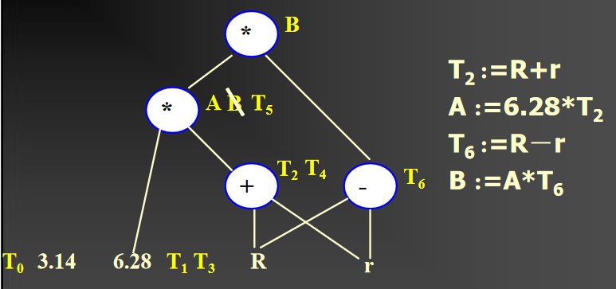

# Intermediate code

代码生成时生成目标机可执行代码，它依赖源语言的特点，关于目标结构的详细信息，runtime环境的结构

主要有三个任务

- 指令选择
- 寄存器分配、指派
- 指令排序

## 中间代码的好处

- 利于生成更高效的代码
- 使编译器更容易re target


## 后缀表达式,Reverse Polish notation

1、首先构造一个运算符栈，此运算符在栈内遵循越往栈顶优先级越高的原则。

2、读入一个用中缀表示的简单算术表达式，为方便起见，设该简单算术表达式的右端多加上了优先级最低的特殊符号“#”。

3、从左至右扫描该算术表达式，从第一个字符开始判断，如果该字符是数字，则分析到该数字串的结束并将该数字串直接输出。

4、如果不是数字，该字符则是运算符，此时需比较优先关系。

具体做法是：将该字符与运算符栈顶的运算符的优先关系相比较。如果该字符优先关系高于此运算符栈顶的运算符，则将该运算符入栈。若不是的话，则将栈顶的运算符从栈中弹出，直到栈项运算符的优先级低于当前运算符，将该字符入栈。

5、重复步骤1～2，直至扫描完整个简单算术表达式，确定所有字符都得到正确处理，便可以将中缀式表示的简单算术表达式转化为逆波兰表示的简单算术表达式。


a+b  ab+

a+b\*c abc\*+

(a+b)*c  ab+c\*


## triples

(op, arg1, arg2)

a:=b\*c+b\*d

(1)(*,b,c)

(2)(*,b,d)

(3)(+,(1),(2))

(4)(:=,(3),a)


## quadruples

(op，ARG1，ARG2，RESULT）


## Three-Address Code

x=y op z

x = op y

x = y

halt 暂停

read/write x

Label

goto L

if B goto L

如

2*a+(b-3)

t1 = 2*a

t2 = b-3

t3=t1+t2

## 翻译

### 1.赋值

id是否已经被声明过，操作数的类型是否匹配

id.name: token id's name

E.place: the address of E in the symbol table

nextstat: the order of the next quadruple

emit(): output a quadruple, nextstat +1

newtemp(): temporaries t0 t1...

error()


S-> id:=E

```
{

    p:=lookup(id.name);

    if p!= nil then emit(:=,E.place,_,p);

    else error

}
```

E->E1+E2

```
{
	E.place:=newtemp;
	if(E1.type=int and E2.type=int)
	{
		emit(+,E1.place,E2.place,E.place);
		E.type:=int
	}
	else if(E1.type=real and E2.type=real){
		emit(+,E1.place,E2.place,E.place);
		E.type := real
	}
	else
	...
	
}
```

E->-E1

```
{
	E.place:=newtemp;
	emit(@,E1.place,_,E.place)
}
```

E->(E1)

```
{E.place := E1.place}
```

E->id

```
{
	p:=lookup(id.name);
	if p!=nil then E.place:=p;
	else error;
}
```

### 2. boolean

not>and>or

arithmetic operator> relational operator>boolean operator

true的四元式后面紧跟false的四元式

直接计算

1 or 0 and 1=1 or 0=1

每一个bool表达式都要算出来，并且用一个临时变量保存


短路运算

短路运算就没有临时bool值

**while的翻译最后一个四元式是跳到条件的开头**

## 优化代码

1.寄存器的使用

利用好寄存器是高效代码的最重要的特征

含寄存器的指令执行速度一般比含内存的指令快很多

寄存器数量很有限，高效利用寄存器是生成好的代码的特别重要一点

2.不必要的操作

避免冗余和不必要的操作

Common sub expression is an expression that appears repeatedly in the code while it’s value remains the same. Repeated evaluation can be eliminated by saving the first value for later use

例如：

(1) T1 =4\*I
(2) T2 =addr(A)-4
(3) T3 =T2[T1]
(4)T4 =4*I =>T4=T1

Avoid storing the value of a variable or temporary that is not subsequently used

没有用到的变量就直接删除

3.Costly Operations

减少Costly Operations的使用

例如用左右移2来代替乘除法

常量的优化

右边是算数表达式就编译器阶段直接计算出来

Determine if a variable might have a constant value for part or all of a program, and such transformations can then also apply to expressions involving that variable

### 优化的分类

time

优化可以在编译的任何期间

在中间代码生成期间：通过转换语法树达到优化的目的，删除子树或者替换为更小的子树

在中间代码生成过后：对中间代码进行优化

在目标代码生成期间：这些优化依赖于目标机

area of program

local优化：局部优化适用于straight-line segments of code，这些代码最后才有jump或者out。A maximal sequence of straight-line code is called a **basic block**。The local optimizations are those that are restricted to basic blocks

全局优化：Optimizations that extend beyond basic blocks, but are confined to an individual procedure

Inter-procedural Optimizations: Optimizations that extend beyond the boundaries of procedure to the entire program

#### flow graph

中间代码的图形表示，进行全局优化

nodes是basic blocks

edge是条件或者非条件跳转


#### DAG(directed acyclic graph)

为基本块创建的，进行局部优化

DAG跟踪在一个基本块中的变量和值的计算和重复赋值

叶节点是要用的值，中间结点是操作符

**同一个结果**的放在中间node的旁边


label和跳转语句不在图中显示

有常数的情况


优化后的



