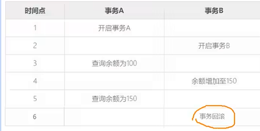
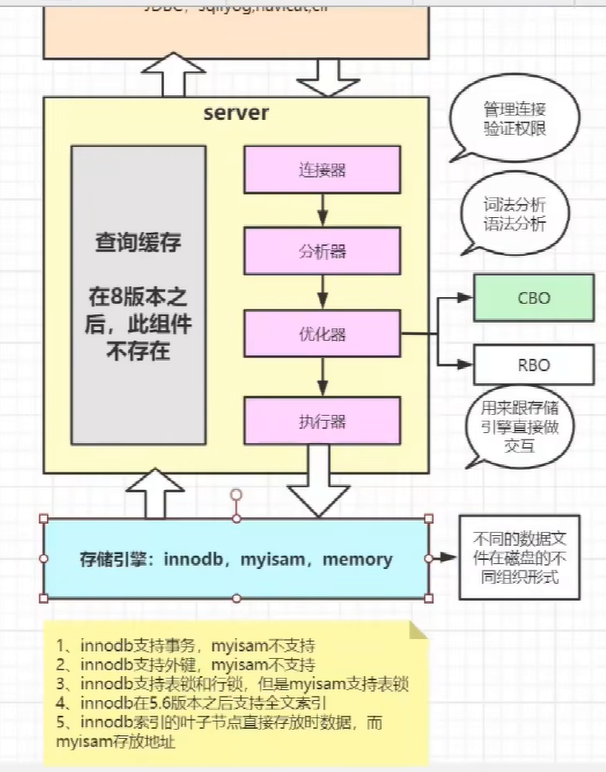
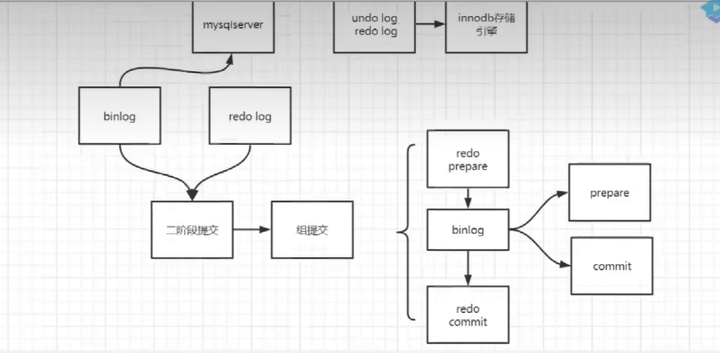

# 操作数据

行是记录，列是字段

```sql
create table t_student(
	sno int(6), -- 6是显示长度
    sname varchar(5), -- 5个字符
    sex char(1),
    age int(3),
    enterdate date,
    email varchar(15)
);
-- 查看表的结构; 显示表的字段详细信息
desc t_student; 

-- 查看建表语句
show create table t_student;
```

类型

- 整数
- 浮点数
- 字符串
  - char          0-255
  - varchar     0-65535
  - BLOB:  binary large object 二进制形式的长文本数据
  - text 长文本数据
- 日期和事件
  - date: 年月日
  - datetime: 年月日时分秒
  - timestamp 


```sql
insert into t_student values()-- 按照定义的顺序填
insert into t_student(sno,sname) values(1,12)-- 不是全字段插入，自行加入字段名字
```

tip:

- int 宽度是显示宽度，如果超过，可以自动扩大宽度，int底层都是四个字节
- 时间的方式多样 '1256-12-23' "1256/12/23" "1256.12.23"
- 字符串不区分单双引号
- 写入当前时间  now() sysdate() CURRENT_DATE()


```sql
update t_student set sex='f' where sno=1;
delete from t_student where sno=1;
```

tip:

- 关键字，表明，字段名不区分大小写
- 默认情况下，内容不区分大小写
- 删除操作不能少from
- 修改和删除别忘了加限制条件


# 操作表

```sql
alter table t_student add score double(5,2);-- 5总位数 2 小数位数
alter table t_student drop score;

alter table t_student add score double(5,2) first;
alter table t_student add score double(5,2) after sex;
alter table t_student modify score float(4.3);-- modify修改列的定义，不改名字
alter table t_student change score score1 double(5,1);-- change修改列的定义，改名字

drop table t_student
```


# 约束

```sql
create table t_student(
	sno int(6) primary key auto_increment, 
    sname varchar(5) not null, 
    sex char(1) default 'M' check(sex='M'||sex='F'),
    age int(3) check(age>18 and age<50),
    enterdate date,
    email varchar(15) unique
);
```

如果主键没有设定值，或者使用null，default都可以自增

 

```sql
create table t_student(
	sno int(6) auto_increament, 
    sname varchar(5) , 
    sex char(1) ,
    age int(3) ,
    enterdate date,
    email varchar(15),
    constraint pk_stu primary key(sno) ,-- 约束名自定义
    constraint ck_stu_sex check(sex='M'||sex='F'),
    constraint ck_stu_age check(age>1 and age<5),
    constraint up_stu_email unique(email)
);
```


```sql
alter table t_student add constraint pk_stu primary key(sno);
alter table t_student add constraint pk_stu auto_increament ;
alter table t_student add constraint ck_stu_age check(age>1 and age<5);
```


```sql
create t_stu(
	sno int primary key auto_increament,
    classno int, -- 不要求与t_class中的字段名字一样
    constraint fk_stu_classno foreign key (classno) reference t_class(cno)
)
```

```sql
create t_stu(
	sno int primary key auto_increament,
    classno int  reference t_class(cno) -- 不要求与t_class中的字段名字一样
)
```

被reference的是父表 删除的话，先删父

外键策略

- 不操作 

  ```sql
  删除班级的一行
  update t_student set classno=null where classno=1
  delete from t_class where cno = 1;
  ```

- cascade 级联操作，操作主表的时候影响从表的外键信息

  ```sql
  /**
  先删除外键约束
  再重新添加
  再更新
  */
  alter table t_student drop foreign key fk_stu_classno;
  alter table t_student add contraint fk_stu_classno foreign key (classno) reference t_class(cno) on update cascade on delete cascade ;
  update t_class set cno = 5 where cno=3;
  delete from t_class where cno = 5;
  ```

- set null

  ```sql
  alter table t_student drop foreign key fk_stu_classno;
  alter table t_student add contraint fk_stu_classno foreign key (classno) reference t_class(cno) on update set null on delete set null ;
  ```


快速创建

```sql
create table t_stu
as 
select sno,age from t_stu where ...
```

```sql
delete from t_stu
truncate table t_stu
```

(1)DELETE为数据操作语言DML;TRUNCATE为数据定义语言DDL。

2) DELETE操作是将表中所有记录一条一条删除直到删除完:TRUNCATE操作则是保留了表的结构，重新创建了这个表，所有的状态都相当于新表
    因此，TRUNCATE操作的效率更高
3) (3)DELETE操作可以回滚: TRUNCATE操作会导致隐式提交因此不能回滚 (在第+章中会讲解事务的提交和回滚)4)DELETE操作执行成功后会返回已删除的行数(如删除4行记录，则会显示“Afected rows:
4) 4”);截操作不会返回已删除的行量，结通常是"Afected rows:0”。DELETE操作删除表中记录后，再次向表中添加新记录时，对于设置有自增约束字段的值会从删除前表中该字段的最大值加开始自增;TRUNCATE操作则会重新从1开始自增。


# 查询

## where

distinct 是对跟在distinct后面的列的组合去重

order by 按照后面列的描述 一个一个排序 

```sql
where binary a="aa";//区分大小写
where a=1 and b=2;
where a=1 && b=2;
where a=1 || b=2;
where a=1 or b=2;
where job in ("a","n");

where name like '%A%' -- %任意多个字符
where name like '_A%' -- _一个字符

where a is null
()可以增加优先级
```


## function

```sql
select lower(a) upper(b) from t  -- 单行函数，

select max(a) min(b) count(a) avg(a) from t -- 多行函数只返回一个结果
```


## group by

```sql
select deptno, avg(salary) from emp;-- 字段和多行函数不可用同时使用,除非这个字段属于分组

select deptno, avg(salary) from emp group by deptno;
select deptno, avg(salary) from emp group by deptno order by deptno desc;
```


## having

分组以后进行筛选

```sql
select deptno, avg(salary) from emp group by deptno having avg(sal)>1000;
```

```sql
select job, avg(salary) from emp where job!="MANAGER" group by job;
select job, avg(salary) from emp group by deptno having job!="MANAGER";
结果一样
不过where在分组前过滤
having再分组后过滤
```


## select顺序

from 

where 

group by 

having

order by

多练习这个


# 多表

```sql
select *
from emp cross join dept;##笛卡尔乘积

select *
from emp natural join dept;##自动匹配所有的同名列，同名列只展示一列
-- 查询字段的时候，没有指定字段所属的表，效率低
-- 解决 指定表名
select emp.ename
from emp natual join dept;
-- 表名太长就起别名

-- 我们只希望匹配部分同名列
select *
from emp inner join dept
using (deptno)-- 只匹配这个

-- 万一名字不一样
select *
from emp e inner join dept d on (e.no = d.no)
```


```sql
-- 外连接，除了显示匹配的数据之外，还可以显示不匹配的数据
left outer join 左边不匹配也会有
right outer join 右边不匹配也会有
```

 

```sql
union
union all 不去重 效率更高
```


```sql
A right outer join B on A.a = b.a inner join C on ...
```

join 和 on看作一个


```sql
select * 
from A a inner join A b
on a.a = b.c -- 自连接
```


## 子查询

 一条sql含有多个select

单行查询就是 子select返回一个

多行就是子select返回多个 一般可以用 in， =any,  all 

```
>all(select  ...)
>select max(....)
```


不相关子查询：子查询可以独立查询，再运行外查询

相关子查询：子查询不可用独立运行 并且先运行外查询 再进行子查询

```
select * 
from emp e
where sal = (
select max(sal) 
from emp 
where emp.no = e.no
)
order by no
```


# 事务

事务就是指一个操作序列，该操作序列中的多个操作要么都做，要么都不做，是一个不可分割的工作单位，是数据库环境中的逻辑工作单位。

ACID

- 原子性：使用事务对数据进行修改的操作序列，要么全执行，要么全不执行
- 一致性：事务执行的结果必须使数据库从一个一致性状态，变到另一个一致性状态
- 隔离性：各个事务的执行互不干扰
- 持久性：事务一旦提交，对数据所作的改变，都要记录再永久存储器中

```sql
-- 默认一个DML语句就是一个事务
-- 将两个操作控制再一个事务中
-- 手动开启事务
start transaction;
update account set balance = balance - 200 where id=1;
update account set balance = balance + 200 where id=2;

-- 手动回滚
rollback;
-- 手动提交
commit;
-- 再回滚和提交之前，数据库的中的数据都是 操作的缓存中的数据，而不是数据库的真实数据
```


# 事务并发

脏读

当一个事务正在访问数据并且对数据进行了修改，而这种修改还没有提交到数据库中，这时另外一个事务也访问了这个数据，然后使用了这个数据。因为这个数据是还没有提交的数据，那么另外一个事务读到的这个数据是“脏数据”，依据“脏数据”所做的操作可能是不正确的。




不可重复读

指在一个事务内多次读同一数据。在这个事务还没有结束时，另一个事务也访问该数据。那么，在第一个事务中的两次读数据之间，由于第二个事务的修改导致第一个事务两次读取的数据可能不太一样。这就发生了在一个事务内两次读到的数据是不样的情况，因此称为不可重复读。


幻读

(Phantom read):幻读与不可重复读类似。它发生在一个事务(T1)读取了几数据，接着另个并发事务(T2)插入了一些数据。在随后的查询中，第一个事务(T1)就会发现多了一些原本不存在的记录，就好像发生了幻觉一样，所以称为幻读,


**不可重复读的重点是修改，幻读的重点在于新增或者删除**

**解决不可重复读的问题只需锁住满足条件的行，解决幻读需要锁表**

## 隔离级别

用来解决上面的问题

```sql
select @@transaction_isolation
set session transaction isolation level read uncommitted;
set session transaction isolation level read committed;// 解决脏读
set session transaction isolation level repeatable read;//解决不可重复读
set session transaction isolation level serializable;// 都欧克 但失去并发的意义
```


# 视图

视图(view)是一个从单张或多张基础数据表或其他视图中构建出来的虚拟表。同基础表一样，视图中也包含了一系列带有名称的列和行数据但是数据库中只是存放视图的定义，也就是动态检索数据的查询语句，而并不存放观图中的数据，这些数据依旧存放于构建视图的基础表中，只有当用户使用视图时才去数据库请求相对应的数据，即视图中的数据是在引用视图时动态生成的。因此视图中的数据依赖于构建视图的基础表，如果基本表中的数据发生了变化，视图中相应的数据也会跟着改变。

PS:: 本质就是一个对应sql的表

集中在所关心地数据上，而不需要关心数据表的结构、与其他表的关联条件以及查询条件等.对机密数据提供安全保护:有了视图，就可以在设计数据库应用系统时，对不同的用户定义不同的视图，避免机密数据(如，敏感字段“salary”)出现在不应该看到这些数据的用户视图上。这样视图就自动提供了对机密数据的安全保护功能


```sql
create view myview
as 
select empno,ename,job 
from emp
where deptno=20;

select * from myview;

create or replace view myview
as 
select empno,ename,job 
from emp
where deptno=20
with check option;-- 会多一个限制
```

插入视图后，原本的也会被插入


# 存储过程

存储过程就是数据库中保存(Stored)的一系列SQL命令Procedure) 的集合

1)提高执行性能。存储过程执行效率之所高，在于通的SQL语句，每次都会对语法分析，编译，执行，而存储过程只是在第一次执行语法分析，编译，执行，以后都是对结果进行调用。
2)可减轻网络负担。使用存储过程，复杂的数据库操作也可以在数据库服务器中完成。只需要从客户端(或应用程序)传递给数据库必要的参数就行，比起需要多次传递SQL命令本身，这大大减轻了网络负担。
3)可将数据库的处理黑匣子化。应用程序中完全不用考虑存储过程的内部详细处理，只需要知道调用哪个存储过程就可以了


```sql
create procedure mypro(name varchar(10))
begin
 if name is null then
 select * from emp;
 else
 select * from emp where name like concat('%',name);
 end if;
 end;
 
call mypro(null);
```


# 面试

join不一定是严格按顺序的，因为内部有优化。




全文索引：例如把一个content中包含java关键字的文章都取出来


调优

索引

- 加快查询速度，但是索引会存储在磁盘上，会占用空间。

- ```
  局部性原理：空间与时间
  磁盘预读。内存跟磁盘在进行交互的时候要保证每次读取需要一个逻辑单位，而这个逻辑单位叫做页，或者叫datapage，一般都是4k或者8k，在进行读取的时候一般都是4k的整数倍innodb每次读取16kb的数据
  ```

- 数据结构：hash： （memory引擎使用hash，同时innodb支持自适应hash）或者树（B+，多叉树，叶节点有序，每个节点存储多条数据）

- mysql的索引一般几层，一般情况下 3到4层就足以支持千万级别的表查询。16kb。关键在于创建索引的字段是长的好还是短的好？短的好，原因是可以存储更多的数据量。用代理主键还是自然主键，尽可能使用代理主键。主键在满足业务条件下使用自增。（原因是B+的插入规则）。在分布式场景中，自增id不适用。使用snowflake（雪花算法）或者自定义id。

- 回表

- 索引覆盖

- 最左匹配

- 索引下推

- 聚簇索引->数据跟索引是否是聚集存储->innodb的主键索引就是聚簇索引,必须要包含一个主键列的: key如果在创建表的时候制定了主键，那么key就是主键，如果没有主键，那么key就是唯一键，如果唯一键也没有，那么key就是6字节的rowid。

- 非聚簇索引：myisam都是，innodn的二级索引，叶节点存主键。也用b+

- ```
  mysql的索引类型跟存储引擎是相关的，innodb存储引擎数据文件跟索引文件全部放在ibd文件中，而myisam的数据文件放在myd文件中，索引放在myi文件中，其实区分聚族索引和非聚簇索引非常简单，只要判断数据跟索引是否存储在一起就可以了。
  innodb存储引擎在进行数据插入的时候，数据必须要跟索引放在一起，如果有主键就使用主键，没有主键就使用唯一键，没有唯一键就使用6字节的rowid，因此跟数据绑定在一起的就是聚簇索引，而为了避免数据几余存储，其他的索引的叶子节点中存储的都是聚族索引的key值，因此innodb中既有聚族索引也有非聚族索引，而myisam中只有非聚簇索引。
  ```

- ```
  MySQL主要用到两种结构: B+ Tree索引和Hash索引
  Inodb存储引擎 默认是B+Tree索引
  Memory 存储引擎 默认 Hash索引;
  MySQL中，只有Memory(Memory表只存在内存中，断电会消失，适用于临时表)存储引擎显示支持Hash索引是Memorv表的默认索引类型，尽管Memorv表也可以使用B+Tree索引。Hash索引把数据以hash形式组织起来因此当查找某一条记录的时候，速度非常快。但是因为hash结构，每个键只对应一个值，而且是散列的方式分布。所以它并不支持范围查找和排序等功能。
  B+Tree是mysql使用最频繁的一个索引数据结构，是InnoDB和MyISAM存储引擎模式的索引类型。相对Hash索引，B+Tree在查找单条记录的速度比不上Hash索引，但是因为更适合排序等操作，所以它更受欢迎。毕竟不可能只对数据库进行单条记录的操作。
  对比:
  hash类型的索引: 查询单条快，范围查询慢
  btree类型的索引: b+树，层数越多，数据量指数级增长(我们就用它，因为inndb默认支持它)
  ```

  

MVCC

- mult-version concurrent control

存储引擎

事务

- 原子性 undo log(保存跟执行操作相反的操作) mvcc
- 一致性
- 隔离性 锁 四种级别
- 持久性 redo log 
- 

一致性非锁定读，一致性锁定读

- ```
  select * from emp for update
  ```

- 

mvc mvvm

主从复制

- MySQL 主从复制是指数据可以从一个MySQL数据库服务器主节点复制到一个或多个从节点。山ysQL 默认采用异步复制方式，这样从节点不用一直访问主服务器来更新自己的数据，数据的更新可以在远程连接上进行，从节点可以复制主数据库中的所有数据库或者特定的数据库，或者特定的表。

- ```
  (1)master服务器将数据的改变记录二进制binlog日志，当master上的数据发生改变时，则将其改变写入二进制日志中;
  (2)slave服务器会在一定时间间隔内对master二进制日志进行探测其是否发生改变，如果发生改变，则开始一个I/OThread请求master二进制事件
  (3)同时主节点为每个/0线程启动一个dump线程，用于向其发送二进制事件，并保存至从节点本地的中继日志中，从节点将启动SOL线程从中继日志中读取二进制日志，在本地重放，使得其数据和主节点的保持一致，最后I/OThread和SQLThread将进入睡眠状态，等待下一次被唤醒。
  ```

- ```
  从库会生成两个线程个I/0线程,一个SQL线程;
  I/0线程会去请求主库的binlog,并将得到的binlog写到本地的relay-log(中继日志)文件中;
  主库会生成一个log dump线程,用来给从库I/0线程传binlog;
  SQL线程,会读取relay log文件中的日志,并解析成sql语句逐一执行;
  ```

- ```
  注意:
  1--master将操作语句记录到binlog日志中，然后授予slave远程连接的权限(master一定要开启binlog二进制日志功能;通常为了数据安全考虑，slave也开启binlog功能)
  。2--slave开启两个线程: 10线程和SQL线程。其中: 0线程负责读取master的binlog内容到中继日志relay log里;SQL线程负责从relay log日志里读出binlog内容，并更新到slave的数据库里，这样就能保证slave数据和master数据保持一致了。
  3--Mysql复制至少需要两个Mysql的服务，当然Mysq服务可以分布在不同的服务器上，也可以在一台服务器上启动多个服务。
  4-Mysql复制最好确保master和slave服务器上的Mysql版本相同(如果不能满足版本一致，那么要保证master主节点的版本低于slave从节点的版本)
  5--master和slave两节点间时间需同步
  ```

- ```
  具体步骤:
  1、从库通过手工执行change master to 语连接主库，提供了连接的用户一切条件 (user 、password.port、ip)，并且让从库知道，二进制日志的起点位置 (file名 position 号); start slave
  2、从库的IO线程和主库的dump线程建立连接。
  3、从库根据change master to 语句提供的file名和position号，I0线程向主库发起binlog的请求,
  4、主库dump线程根据从库的请求，将本地binlog以events的方式发给从库I0线程
  5、从库10线程接收binlog events，并存放到本地relay-log中，传送过来的信息，会记录到master.info中6、从库SQL线程应用relay-log，并且把应用过的记录到relay-log.info中，默认情况下，已经应用过的relay 会自动被清理purge
  ```

- 解决延迟

为什么要主从同步

1、在业务复杂的系统中，有这么一个情景，有一句sal语句需要锁表，导致暂时不能使用读的服务，那么就很影响运行中的业务，使用主从复制，让主库负责写，从库负责读，这样，即使主库出现了锁表的情景，通过读从库也可以保证业务的正常运作。
2、做数据的热备
3、架构的扩展。业务量越来越大，I/O访问频率过高，单机无法满足，此时做多库的存储，降低磁盘I/O访问的频率，提高单个机器的I/0性能。


## 锁

- 共享锁(share lock): 共享锁又称读锁，简称 S 锁，当一个事务为数据加上读锁之后，其他事务只能对该数据加读锁，而不能对数据加写锁，直到所有的读锁释放之后其他事务才能对其进行加持写锁。共享锁的特性主要是为了支持并发的读取数据，读取数据的时候不支持修改，避免出现重复读的问题。
- 排他锁(exclusive lock):排他锁又称写锁，简称锁;当一个事务为数据加上写锁时，其他请求将不能再为数据加任何锁，直到该锁释放之后，其他事务才能对数据进行加锁。排他锁的目的是在数据修改时候，不允许其他人同时修改，也不允许其他人读取，避免了出现脏数据和脏读的问题。
- 表锁(table lock): 表锁是指上锁的时候锁住的是整个表，当下一个事务访问该表的时候，必须等前一个事务释放了锁才能进行对表进行访问;特点:粒度大，加锁简单，容易冲突;
- 行锁: 行锁是指上锁的时候锁住的是表的某一行或多行记录，其他事务访问同一张表时，只有被锁住的记录不能访问，其他的记录可正常访问，特点: 粒度小，加锁比表锁麻烦，不容易冲突，相比表锁支持的并发要高
- 记录锁(Record lock):记录锁也属于行锁中的一种，只不过记录锁的范围只是表中的某一条记录，记录锁是说事务在加锁后锁住的只是表的某一条记录，加了记录锁之后数据可以避免数据在查询的时候被修改的重复读问题，也避免了在修改的事务未提交前被其他事务读取的脏读问题
- 页锁:页级锁是 MysQL 中锁定粒度介于行级锁和表级锁中间的一种锁，表级锁速度快，但冲突多，行级冲突少但速度慢。所以取了折衷的页级，一次锁定相邻的一组记录。特点: 开销和加锁时间界于表锁和行锁之间，会出现死锁;锁定粒度界于表锁和行锁之间，并发度一般。
- 间隙锁: 是属于行锁的一种，间隙锁是在事务加锁后其锁住的是表记录的某一个区间，当表的相邻ID之间出现空隙则会形成一个区间，遵循左开右闭原则。范围查询并且查询未命中记录，查询条件必须命中索引、间隙锁只会出现在REPEATABLE_READ (重复读)的事务级别中。
- 临键锁 (Next-Key lock): 也属于行锁的一种，并且它是INNODB的行锁默认算法，总结来说它就是记录锁和间隙锁的组合，临键锁会把查询出来的记录锁住，同时也会把该范围查询内的所有间隙空间也会锁住，再之它会把相邻的下一个区间也会锁住。


## sql执行计划


## 简述mysql中索引类型有哪些，以及对数据库的性能的影响?

普通索引: 允许被索引的数据列包含重复的值

唯一索引: 可以保证数据记录的唯一性主键索引:是一种特殊的唯一索引，在一张表中只能定义一个主键索引，主键用于唯一标识一条记录，使用关键字primary key来创建

联合索引:索引可以覆盖多个数据列

全文索引:通过建立倒排索引，可以极大的提升检索效率，解决判断字段是否包含的问题，是目前搜索引擎使用的一种关键技术

索引可以极大地提高数据的查询速度

通过使用索引，可以在查询的过程中，使用优化隐藏器，提高系统的性能但是会降低插入、删除、更新表的速度，因为在执行这些写操作的时候，还要操作索引文件

索引需要占物理空间，除了数据表占数据空间之外，每一个索引还要占一定的物理空间，如果要简历聚簇索引，那么需要的空间就会更大，如果非聚簇索引很多，一旦聚簇索引改变，那么所有非聚簇索引都会跟着变

### 设计原则

在进行索引设计的时候，应该保证索引字段占用的空间越小越好，这只是一个大的方向，还有一些细节点需要注意下:
1、适合索引的列是出现在where字句中的列，或者连接子句中指定的列
2、基数较小的表，索引效果差，没必要创建索引
3、在选择索引列的时候，越短越好，可以指定某些列的一部分，没必要用全部字段的值

4、不要给表中的每一个字段都创建索引，并不是索引越多越好
5、定义有外键的数据列一定要创建索引
6、更新频繁的字段不要有索引
7、创建索引的列不要过多，可以创建组合索引，但是组合索引的列的个数不建议太多
8、大文本、大对象不要创建索引

*在数据库中,某一列的唯一键(distinct Keys)的数量叫作基数。* 比如性别列,该列只有男女之分,所以这一列基数是2。主键列的基数等于表的总行数。

## 处理慢查询

1、开启慢查询日志，准确定位到哪个sql语句出现了问题
2、分析sql语句，看看是否load了额外的数据，可能是查询了多余的行并且抛弃掉了，可能是加载了许多结果中并不需要的列，对语句进行分析以及重写
3、分析语句的执行计划，然后获得其使用索引的情况，之后修改语句或者修改索引，使得语句可以尽可能的命中索引
4、如果对语句的优化已经无法进行，可以考虑表中的数据量是否太大，如果是的话可以进行横向或者纵向的分表


