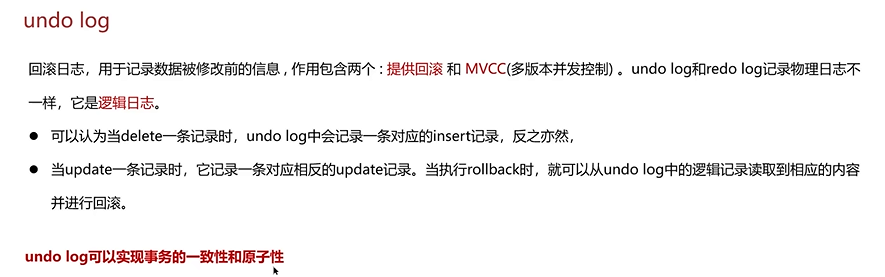
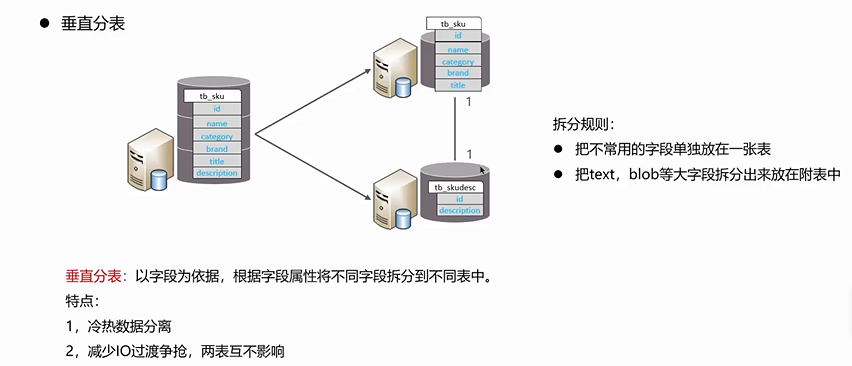
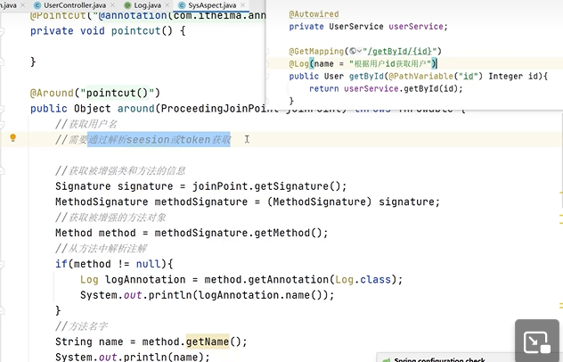

# redis

使用场景

- 根据业务
- 缓存
- 分布式锁

## 缓存穿透

缓存穿透:查询一个不存在的数据，mysql查询不到数据也不会直接写入缓存，就会导致每次请求都查数据库

解决方案一:缓存空数据，查询返回的数据为空，仍把这个空结果进行缓存

优点:简单

缺点:消耗内存，可能会发生不一致的问题


布隆过滤器

作用：检索一个元素是否在一个集合中，使用位图

存储数据:id为1的数据，通过**多个hash**函数获取hash值，根据hash计算数组对应位置改为1


优点:内存占用较少，没有多余key

缺点:实现复杂，存在误判


## 缓存击穿

缓存击穿:给某一个key设置了过期时间，当key过期的时候，恰好这时间点对这个key有大量的并发请求过来，这些并发的请求可能会瞬间把DB压垮。


第二个不保证绝对一致


## 缓存雪崩

缓存雪崩是指在同一时段大量的缓存key同时失效或者Redis服务宕机，导致大量请求到达数据库，带来巨大压力。

解决方案：

- 给不同的Key的TTL添加随机值
- 利用Redis集群提高服务的可用性
- 给缓存业务添加降级限流策略
- 给业务添加多级缓存


## 双写一致性

双写一致性:当修改了数据库的数据也要同时更新缓存的数据，缓存和数据库的数据要保持一致

读操作:缓存命中，直接返回;缓存未命中查询数据库，写入缓存，设定超时时间

写操作：双删


下面两次都有问题


延迟：是为了主从复制，不过不一定保证。


接收短暂延迟


## 持久化

RDB全称Redis Database Backup file (Redis数据备份文件)，也被叫做Redis数据快照。简单来说就是把内存中的所有数据都记录到磁盘中。当Redis实例故障重启后，从磁盘读取快照文件，恢复数据


### RDB原理

bgsave开始时会fork主进程得到子进程，子进程共享主进程的内存数据。完成fork后读取内存数据并写入 RDB 文件。


### AOF

因为是记录命令，AOF文件会比RDB文件大的多。而且AOF会记录对同一个key的多次写操作，但只有最后一次写操作才有意义。通过执行bgrewriteaof命令，可以让AOF文件执行重写功能，用最少的命令达到相同效果。


## 数据过期策略

假如redis的key过期之后，会立即删除吗?

惰性删除:设置该key过期时间后，我们不去管它，当需要该key时，我们在检查其是否过期，如果过期，我们就删掉它，反之返回该key。

优点:对CPU友好，只会在使用该key时才会进行过期检查，对于很多用不到的key不用浪费时间进行过期检查
缺点:对内存不友好，如果一个key已经过期，但是一直没有使用，那么该key就会一直存在内存中，内存永远不会释放


定期删除:每隔一段时间，我们就对一些key进行检查，删除里面过期的key(从一定数量的数据库中取出一定数量的随机key进行检查，并删除其中的过期key)。

SLOW模式是定时任务，执行频率默认为10hz，每次不超过25ms，以通过修改配置文件redis.conf 的hz 选项来调整这个次数

FAST模式执行频率不固定，但两次间隔不低于2ms，每次耗时不超过1ms


优点:可以通过限制删除操作执行的时长和频率来减少删除操作对 CPU 的影响。另外定期删除，也能有效释放过期键占用的内存。

缺点:难以确定删除操作执行的时长和频率


Redis的过期删除策略: 惰性删除 + 定期删除两种策略进行配合使用


## 数据淘汰策略

内存满了，要删一点缓存。

数据的淘汰策略: 当Redis中的内存不够用时，此时在向Redis中添加新的key，那么Redis就会按照某一种规则将内存中的数据删除掉，这种数据的删除规则被称之为内存的淘汰策略。


1. 数据库有1000万数据，Redis只能缓存20w数据如何保证Redis中的数据都是热点数据?

   使用allkeys-lru(挑选最近最少使用的数据淘汰)淘汰策略，留下来的都是经常访问的热点数据

2. Redis的内存用完了会发生什么?
主要看数据淘汰策略是什么?如果是默认的配置(noeviction )，会直接报错


## 分布式锁

如果是单个服务器，一个synchronized就够了。

但是多个服务器这么搞

超卖超买的问题

Redis实现分布式锁主要利用Redis的setnx命令。setnx是SET if not exists(如果不存在，则SET)的简写


Redis实现分布式锁如何合理的控制锁的有效时长?

根据业务执行时间预估

给锁续期


redisson


可重入：看线程id是否一致


## 主从复制


#### 流程

## redis后面的三种模式


## 其他redis

Redis是单线程的，但是为什么还那么快

- Redis是纯内存操作，执行速度非常快
- 采用单线程，避免不必要的上下文切换可竞争条件，多线程还要考虑线程安全问题
- 使用I/O多路复用模型，非阻塞IO


能解释一下I/O多路复用模型?

Redis是纯内存操作，执行速度非常快，它的性能瓶颈是网络延迟而不是执行速度，I/0多路复用模型主要就是实现了高效的网络请求


10多路复用是利用单个线程来同时监听多个Socket，并在某个Socket可读、可写时得到通知，从而避免无效的等待充分利用CPU资源。不过监听Socket的方式、通知的方式又有多种实现，常见的有:

select

poll

epoll

select和poll只会通知用户进程有Socket就绪，但不确定具体是哪个Socket，需要用户进程逐个遍历Socket来确认

epoll则会在通知用户进程Socket就绪的同时，把已就绪的Socket写入用户空间


redis IO复用

是指利用单个线程来同时监听多个Socket，并在某个Socket可读、可写时得到通知，从而避免无效的等待，充分利用CPU资源。目前的I/0多路复用都是采用的epoll模式实现，它会在通知用户进程Socket就绪的同时，把已就绪的Socket写入用户空间，不需要挨个遍历Socket来判断是否就绪，提升了性能。

redis网络模型

就是使用I/O多路复用结合事件的处理器来应对多个Socket请求

- 连接应答处理器
- 命令回复处理器，在Redis6.0之后，为了提升更好的性能，使用了多线程来处理回复事件
- 命令请求处理器，在Redis6.0之后，将命令的转换使用了多线程，增加命令转换速度，在命令执行的时候，依然是单线程


# Mysql

## 定位慢查询

页面加载过慢。

如何定位：

调试工具：Arthas

运维工具：Prometheus 、Skywalking


方案二：

自带的慢日志

慢查询日志记录了所有执行时间超过指定参数 (long_query_time，单位:秒，默认10秒)的所有SQL语句的日志如果要开启慢查询日志，需要在MySQL的配置文件(/etc/my.cnf)中配置如下信息:

```
#开启MySQL慢日志查询开关
slow query log=1
# 设置慢日志的时间为2秒，SQL语句执行时间超过2秒，就会视为慢查询，记录慢查询日志long_query_time=2
```


## 分析慢的原因

前三个是sql执行计划

在sql前面加explain 或者 desc

- 聚合查询
- 多表查询
- 表数据量过大查询
- 深度分页查询


分析：

- possible key当前sql可能会使用到的索引
- key 当前sql实际命中的索引
- key_len 索引占用的大小
- Extra 额外的优化建议 
  - Using where; Using Index 查找使用了索引，需要的数据都在索引列中能找到，不需要回表查询数据
  - Using index condition 查找使用了索引，但是需要回表查询数据
- type 这条sql的连接的类型，性能由好到差为NULL、system、const、e refref、range、 index、all
  - system:查询系统中的表
  - const:根据主键查询
  - eq_ref:主键索引查询或唯一索引查询r
  - ref:索引查询r
  - ange:范围查询
  - index:索引树扫描
  - all:全盘扫描


面试官:那这个SQL语句执行很慢, 如何分析呢?

候选人: 如果一条sql执行很慢的话，我们通常会使用mysql自动的执行计划explain来去查看这条sql执行情况，比如在这里面可以通过key和key_len检查是否命中了索引 非NULL就命中，如果本身已经添加了索引，也以判断索引是否有失效的情况，第二个，可以通过type字段查看sql是否有进一步的优化空间，是否存在全索引扫描或全盘扫描，第三个可以通过extra建议来判断，是否出现了回表的情况，如果出现了，可以尝试添加索引或修改返回字段来修复


## 索引

什么是索引？

- 索引(index)是帮助MySQL高效获取数据的数据结构(有序)
- 提高数据检索的效率，降低数据库的IO成本(不需要全表扫描)
- 通过索引列对数据进行排序，降低数据排序的成本，降低了CPU的消耗


以一颗最大度数(max-degree)为5(5阶)的b-tree为例，那这个B树每个节点最多存储4个key

B树与B+树对比:

- 磁盘读写代价B+树更低;
  - 非叶子节点只存储指针，不存储数据，所以压力比较小
  - 如果是b树，他要把数据找出来，加载出来。
- 查询效率B+树更加稳定，
  - b+都要到叶子节点上，查找路径长度差不多
- B+树便于扫库和区间查询
  - 叶节点直接使用双向指针，范围的数据就容易通过指针获取。


底层数据结构？

MySQL的InnoDB引擎采用的B+树的数据结构来存储索引

阶数更多，路径更短

磁盘读写代价B+树更低，非叶子节点只存储指针，叶子阶段存储数据

B+树便于扫库和区间查询，叶子节点是一个双向链表


### 聚簇与非聚簇

什么是聚集索引，什么是二级索引(非聚集索引)

   


回表


### 覆盖索引

覆盖索引是指查询**使用了索引**，并且**需要返回的列，在该索引中已经全部能够找到。**

- 使用id查询，直接走聚集索引查询，一次索引扫描，直接返回数据，性能高
- 如果返回的列中没有创建索引，有可能会触发回表查询，尽量避免使用select *


MYSQL超大分页处理

问题:在数据量比较大时，limit分页查询，需要对数据进行排序，效率低

解决方案:覆盖索引+子查询


### 创建索引原则

**1).针对于数据量较大，且查询比较频繁的表建立索引。单表超过10万数据 (增加用户体验**

**2).针对于常作为查询条件 (where)、排序 (order by) 、分组 (group by) 操作的字段建立索引。**

3).尽量选择区分度高的列作为索引，尽量建立唯一索引，区分度越高，使用索引的效率越高。

4).如果是字符串类型的字段，字段的长度较长，可以针对于字段的特点，建立前缀索引。

**5).尽量使用联合索引，减少单列索引，查询时，联合索引很多时候可以覆盖索引，节省存储空间，避免回表，提高查询效率。**

**6).要控制索引的数量，索引并不是多多益善，索引越多，维护索引结构的代价也就越大，会影响增删改的效率。**

7如果索引列不能存储NULL值，请在创建表时使用NOT NULL约束它。当优化器知道每列是否包含NULL值时，它可以更好地确定哪个索引最有效地用于查询。


### 索引失效

1).违反最左前缀法则

如果索引了多列，要遵守最左前缀法则。指的是查询从索引的最左前列开始，并且不跳过索引中的列。匹配最左前缀法则，走索引:


根据len的大小判断哪些失效了


由于，在查询是，没有对字符串加单引号，MySQL的查询优化器，会自动的进行类型转换，造成索引失效


## sql优化

表的设计优 参考阿里开发手册《嵩山版》)

- 比如设置合适的数值(tinyint int bigint)，要根据实际情况选择
- 比如设置合适的字符串类型(char和varchar) char定长效率高，varchar可变长度，效率稍低

索引优化

SQL语句优化

- SELECT语句务必指明字段名称(避免直接使用select *

- SQL语句要避免造成索引失效的写法

- 尽量用union all代替union union会多一次过滤，效率低

- 避免在where子句中对字段进行表达式操作

- Join优化能用inner join 就不用left join right join，如必须使用一定要以小表为驱动

  内连接会对两个表进行优化，优先把小表放到外边，把大表放到里边。left join 或 right join，不会重新调整顺序

主从复制、读写分离

- 如果数据库的使用场景读的操作比较多的时候，为了避免写的操作所造成的性能影响 可以采用读写分离的架构读写分离解决的是，数据库的写入，影响了查询的效率。

分库分表


## 事务

### 事务的特性

ACID


### 并发事务发生的问题


### redo log和undo log





面试官: undo log和redo log的区别？

候选人: 好的，其中redo log日志记录的是数据页的物理变化，服务宕机可用来同步数据，而undo log不同，它主要记录的是逻辑日志，当事务回滚时，通过逆操作恢复原来的数据，比如我们剥除一条数据的时候，就会在undo log日志文件中新增一条delete语句，如果发生回滚就执行逆操作;
redo log保证了事务的持久性，undo log保证了事务的原子性和一致性。


### 隔离性如何保证

锁:排他锁(如一个事务获取了一个数据行的排他锁，其他事务就不能再获取该行的其他锁)

mvcc:多版本并发控制


#### mvcc

实现原理

- 记录中的隐藏字段

  

  - 回滚日志，在insert、update、delete的时候产生的便于数据回滚的日志当insert的时候，产生的undo log日志只在回滚时需要，在事务提交后，可被立即删除。而update、delete的时候，产生的undo log日志不仅在回滚时需要，mvcc版本访问也需要，不会立即被删除。
  - undo log版本链。会形成一个链表

- readview

  - ReadView(读视图)是 快照读 SQL执行时MVCC提取数据的依据，记录并维护系统当前活的事务(未提交的) id。
  - 快照读
    - 简单的select(不加锁)就是快照读，快照读，读取的是记录数据的可见版本，有可能是历史数据，不加锁，是非阻塞读.
      Read Committed:每次select，都生成一个快照读。
      Repeatable Read:开启事务后第一个select语句才是快照读的地方。
  - 


好的，事务中的隔离性是如何保证的呢? (你解释一下MVCC)

MySQL中的多版本并发控制。指维护一个数据的多个版本，使得读写操作没有冲突

隐藏字段:
Dtrx id(事务id)，记录每一次操作的事务id，是自增的
@roll pointer(回滚指针)，指向上一个版本的事务版本记录地址 

undo log:

- 回滚日志，存储老版本数据
- 版本链:多个事务并行操作某一行记录，记录不同事务修改数据的版本，通过roll pointer指针形成一个链表。

readView解决的是一个事务查询选择版本的问题

根据readView的匹配规则和当前的一些事务id判断该访问那个版本的数据》不同的隔离级别快照读是不一样的，最终的访问的结果不一样

- RC:每一次执行快照读时生成ReadView
- RR:仅在事务中第一次执行快照读时生成ReadView，后续复用


## 主从复制

二进制日志(BINLOG)记录了所有的 DDL(数据定义语言)语和 DML(数操纵语言)语，但包括数据查询(SELECT、SHOW)。


1Master 主库在事务提交时，会把数据变更记录在二进制
日志文件 Binlog 中。

2.从库读取主库的二进制日志文件 Binlog，写入到从库的
中继日志 Relay Log

3.slave重做中继日志中的事件，将改变反映它自己的数据


## 分库分表

解决存储压力


垂直分库

- 不同库存不同表
- 


垂直分表

- 不同字段放在不同库
- 


水平分库

一个库的数据分别放在不同库


# spring

## bean线程安全

bean默认单例

不是线程安全的

无状态，不会被修改的，就不会有线程安全问题


Spring框架中的单例bean是线程安全的吗?

Spring框架中有一个@Scope注解，默认的值就是singleton，单例的因为一般在spring的bean的中都是注入无状态的对象，没有线程安全问题，如果在bean中定义了可修改的成员变量，是要考虑线程安全问题的，可以使用多例或者加锁来解决


## aop

AOP称为面向切面编程，用于将那些与业务无关，但却对多个对象产生影响的公共行为和逻辑，抽取并封装为一可重用的模块，这个模块被命名为“切面” (Aspect)，减少系统中的重复代码，降低了模块间的耦合度，同时提高了系统的可维护性。

常见的AOP使用场景:

- 记录操作
- 日志缓存处理
- Spring中内置的事务处理





记录操作日志，缓存，spring实现的事务
核心是:使用aop中的环绕通知+切点表达式(找到要记录日志的方法)通过环绕通知的参数获取请求方法的参数(类、方法、注解、请求方式等)，获取到这些参数以后，保存到数据库


其本质是通过AOP功能，对方法前后进行拦截，在执行方法之前开启事务，在执行完目标方法之后根据执行情况提交或者回滚事务


事务失败的原因

- 异常捕获处理，自己处理了异常，没有抛出，解决:手动抛出
- 抛出检查异常，配置rollbackFor属性为Exception
- 非public方法导致的事务失效，改为public


## bean的声明周期


### 循环引用


## spring MVC


## 自动配置原理


1，在Spring Boot项目中的导类上有一个注解@SpringBootApplication，这个注解是对三个注解进行了封装，分别是:
@SpringBootConfiquration
@EnableAutoConfiquration
@ComponentScan
2，其中@EnableAutoConfiguration是实现自动化配置的核心注解。该注解通过@lmport注解导入对应的配置选择器

.内部就是读取了该项目和该项目用的Jar包的的classpath路径下META-INF/spring.factories文件中的所配置的类的全类名。在这些配置类中所定义的Bean会根据条件注解所指定的条件来决定是否需要将其导入到Spring容器中。

3条件判断会有像@ConditionalOnClass这样的注解，判断是否有对应的class文件，如果有则加截该类，把这个配置类的所有的Bean放入spring容器中使用。


## 常见注解


# 集合面试题

## ArrayList

数组(Array)是一种用连续的内存空间存储相同数据类型数据的线性数据结构。

在根据数组索引获取元素的时候，会用索引和寻址公式来计算内存所对应的元素数据，寻址公式是:数组的首地址+索引乘以存储数据的类型大小

如果数组的索引从1开始，寻址公式中，就需要增加一次减法操作，对于CPU来说就多了一次指念，性能不高。


## hashmap

底层使用hash表。即数组或者链表。或红黑树


### put


### 扩容


# 设计模式

## 工厂方法

### 简单工厂

把创建类的过程抽象成一个类。

然后要创建对象的时候，创建一个工厂类，然后传入参数，看获得那种类，然后返回这个类。


### 抽象工厂

抽象工厂模式是工厂方法模式的升级版本，工厂方法模式只生产一个等级的产品，而抽象工厂模式可生产多个等级的产品.一个超级工厂创建其他工厂。该超级工厂又称为其他工厂的工厂

相当于上面的咖啡工厂还可以创建甜品类。


## 策略

该模式定义了一系列算法，并将每个算法封装起来，使它们可以相互替换，且算法的变化不会影响使用算法的客户

它通过对算法进行封装，把使用算法的责任和算法的实现分割开来，并委派给不同的对象对这些算法进行管理


策略模式的主要角色如下:
抽象策略(Strategy)类:这是一个抽象角色，通常由一个接口或抽象类实现。此角色给出所有的具体策略类所需的接口。

具体策略(Concrete Strategy) 类: 实现了抽象策略定义的接口，提供具体的算法实现或行为环境

(Context)类: 持有一个策略类的引用，最终给客户端调用


==就是利用多态==

优点:
策略类之间可以自由切换

易于拓展

避免使用多重条件选择语句 (if else)，充分体现面向对象设计思想


## 责任链

责任链模式:为了避免请求发送者与多个请求处理者耦合在一起，将所有请求的处理者通过前一对象记住其下一个对象的引用而连成一条链;当有请求发生时，可将请求沿着这条链传递，直到有对象处理它为止

比如拦击器，springMVC


主要是setHandler


