## 微服务的概念

martin fowler

一个应用应该是一组小型服务；可以通过HTTP的方式进行互通

每一个功能元素最终都是一个可独立替换的独立升级的软件单元


## POM文件的分析

```xml
<parent>
    <groupId>org.springframework.boot</groupId>
    <artifactid>spring-boot-starter-parent</artifactId>
    <version>1.5.9.RELEASE</version>
</parent>
这个的父项目是
<parent>
    <groupId>org.springframework.boot</groupId>
    <artifactId>spring-boot-dependencies</artifactId>
    <version>1.5.9.RELEASE</version>
    <relativePath>../../spring-boot-dependencies</relativePath>
</parent>
这个才是真正管理springboot的所有依赖
```

以后导入依赖就可以不用版本号。但是没有在dependencies里面的要写


```xml
spring-boot-stater-web
```

Spring Boot将所有的功能场景都抽取出来，做成一个个的starters(启动器)，只需要在项目里面引入这些
starter相关场景的所有依赖都会导入进来。比如spring-boot-mail


```java
@SpringBootApplication

@Configuration 配置类来标注这个注解 代替配置文件 也是一个@Component
@EnableAutoConfiguration: 开启自动配置
@AutoConfigurationPackage
@Import: 底层注解 给容器中导入一个组件 AutoConfigurationPackages.Registrar.class ;
```

将主配置类(@SpringBootApplication标注的类)的所在包及下面所有子包里面的所有组件扫描到Spring容器

@lmport(EnableAutoConfigurationlmportSelector.class) ;

- 给容器中导入组件 ?

- EnableAutoConfigurationlmportSelector: 导入哪些组件的选择器;
- 将所有需要导入的组件以全类名的方式返回;这些组件就会被添加到容器中;
- 会给容器中导入非常多的自动配置类(xxxAutoConfiguration );就是给容器导入这个场景需要的所有组件，并配置好这些组件;

有了自动配置类，免去了我们手动编写配置注入功能组件等的工作;

SpringFactoriesLoader.loadFactoryNames(EnableAutoConfiguration.class,classLoader) ;Spring Boot在启动的时候从类路径下的META-INF/spring.factories中获取EnableAutoConfiguration指定的值。将这些值作为自动配置类导入到容器中，自动配置类就生效，帮我们进行自动配置工作;


```
@RespondBody
@Controller

等价于

@RestController
```


resources

- static: 静态资源 js css imgage
- template:保存所有的模板页面。SpringBoot默认jar包使用嵌入的Tomcat，默认不支持JSP,可以使用模板引擎freemarker thymeleaf 
- application.properties: 配置文件


## 配置文件

- application.properties
- application.yml

yaml

```yaml
server:
	port:8080
```

基本语法

```
k:(一个空格) v  表示键值对
server: 
	port:111使用缩进表示层级
```


字面量

```yaml
k: v
直接写 字符串默认不加上单引号或者双引号
	"":不会转移特殊字符  \n 会引起换行
	'':会转义特殊字符串  \n 就会显示\n
	
```

对象

```yaml
person:
	age:
	name:

person: {name: 1, age: 12}注意空格
```


数组

````yaml
pets:
 -cat
 -dog

pets: [cat,dog]
````


获取yaml的数据 注入

```java
@Component
@ConfigurationProperites(prefix = "person")
```

单元测试

```
@Runwith(SpringRunner.class)
@SpringTest
```


application.properties使用的时候编码问题

改一下idea配置


注入的另一种方法

```java
@Value("${person.name}")
```


属性名匹配规则( Relaxed binding )

-person.firstName:使用标准方式

-person.first-name:大写用-

-person.first_name:大写用_

PERSON FIRST NAME:推荐系统属性使用这种写法


|                       | @ConfigurationProperties | @Value     |
| --------------------- | ------------------------ | ---------- |
| 操作                  | 批量注入配置文件中的属性 | 一个个指定 |
| 功能松绑定(松散语法 ) | y                        | n          |
| SpEL                  | n                        | y          |
| JSR303数据校验        | y                        | n          |

如果说，我们只是在某个业务逻辑中需要获取一下配置文件中的某项值，使用@Value ;
如果说，我们专门编写了一个javaBean来和配置文件进行映射，我们就直接使用@ConfigurationProperties;


数据校验

```
@Validated
@ConfigurationProperties(prefix='person')
class person{
	@Email
	string email;
}
```


指定配置文件

```java
@PropertySource(value={"classpath:person.properties"})
```

```java
@ImportResource导入Spring的配置文件 标注在配置类上
@ImportResource(location={"classpath:beans.xml"})  里面有bean
```

推荐使用注解

使用配置类实现 添加组件

```java
@Configuration
public class Config{
    @Bean//默认的id就是这个方法名
    public helloService()
    {
        return new HelloSerice();
    }
}
```


配置文件占位符

```java
1.随机值
$frandom.value)、$(random.int)、$(random.long)${random.int(10)}、$(random.int[1024,65536]}
2.获得之前配置的值，如果没有可以用:指定默认值
    
app.name=MyApo
app.description ${app.name] is a Spring Boot application
```


Profile

Profile是Spring对不同环境提供不同配置功能的支持，可以通过激活指定参数等方式快速切换环境

1.多profile文件

多个properties文件

2.yaml

```yaml
server:
	port: 8081
spring:
	profiles:
		active: dev
--- #块分割
server:
	port: 8082
spring:
	profiles: dev

---
server:
	port: 8083
```

3.如何激活

在主文件中指定

```java
spring.profiles.active=true
```

命令行

```shell
1.在idea中配置参数 program arguments那里springprofiles.active=dev
2.打包的时候 java -Jar spring-boot-02-config-0.0.1-SNAPSHOTjar --springprofiles.active=dev
3.idea中 vm -Dspringprofiles.active=dev
```


配置文件加载位置

spring boot 启动会扫描以下位置的application.properties或者application.yml文件作为Spring boot的默认配置文件

- file:./config/

- file:./
- -classpath:/config/
- classpath:/
- 以上是按照优先级从高到低的顺序，所有位置的文件都会被加载，高优先级配置内容会覆盖低优先级配置内容。互补配置
我们也可以通过配置spring.config.location来改变默认配置


外部配置

1.命令行参数

2.来自java:comp/env的JNDI属性

3.Java系统属性( System.getProperties())

4.操作系统环境变量

5.RandomValuePropertySource配置的random.*属性值

6.jar包外部的application-profile}.properties或application.yml(带spring.profile)配置文件

7.jar包内部的application-{profile}.properties或application.ym(带spring.profile)配置文件

8.jar包外部的application.properties或application.yml不带springprofile)配置文件

9.jar包内部的application.properties或application.yml(不带spring.profile)配置文件

10.@Configuration注解类上的@PropertySource

11.通过SpringApplication.setDefaultProperties指定的默认属性


## 自动配置的原理

配置文件的属性参照官网

原理：

1)、SpringBoot启动的时候加载主配置类，开启了自动配置功能 @EnableAutoConfiguration
2)、@EnableAutoConfiguration 作用 :

- 利用EnableAutoConfiguratlonlmportSelector给容器中导入一些组件?

- 可以使用selectlmports()方法的内容;

- List<String> configurations = getCandidateConfigurations(annotationMetadata

- attributes);获取候选的配置

  - ```
    SpringFactoriesLoader.loadFactoryllames()
    扫描所有jar包类路径下 META-INF/spring.factories
    把扫描到的这些文件的内容包装成properties对象
    从properties中获取到EnableAutoConfiguration.class类(类名)对应的值，然后把他们添加在容器中
    ```

    将类路径下 META-INF/spring.factories 里面配置的所有EnableAutoConfiguration的值加入到了容器中;

3)、每一个自动配置类进行自动配置功能

每个类就像上面写的配置类一样

例子


```java
@Configuration //表示这是一个配置类，以前编写的配置文件一样，也可以给奢器中添加组件
@EnableConfigurationProperties(HttpEncodingProperties.class) //启动指定类的ConfigurationPropertes功能;将配警文件中对应的值和HttpEncodingProperties绑定起来;
@ConditionalOnWebApplcation //Spring底层onditional注牌( Sprng注牌版)，根据不同的条件，如果满足指定的条件，整个配置类里面的配置就会生效;判断当前应用是否是web应用，如果是，当前配置类生效
@Conditional0nClass(CharacterEncodingFilter.class) //判断当前项目有没有这个类CharacterEncodingFilter ;SpringMVC中进行乱码解决的过滤器;
@Conditionafonproperty(prefix  "spring.http.encoding", value  "enabled", matchifMissing"true) //判断配置文件中是否存在某个配置 spring.http.encoding.enabled ;如果不存在，判断也是成立的
public class HttpEncodingAutoConfiguration {
    HttpEncodingProperties httpEncodingProperties;
}
```


```
@ConfigurationProperties(prefix =“spring.http.encoding") //从配置文件中获取指定的值和bean的属性进行绑定
public class HttpEncodingProperties {
public static final Charset DEFAULT CHARSET  Charset.forName("UTF-8");
```

**能配置的属性都是根据对应的properties类**


```
@Conditional
```

我们可以在配置文件通过debug=true属性 打印配置报告


## 日志

日志抽象层：SLF4j 只提供统一api

日志实现：Logback

spring底层使用JCL

springboot使用SLF4j和logback


### 如何使用

存在Adapter

统一日志系统：先排除其他框架，然后用中间包替换原来的日志框架，最后导入slf4j其他的实现

```xml
spring-boot-start-logging
```

SpringBoot能自动适配所有的日志，而且底层使用slf4j+logback的方式记录日志，引入其他框架的时候，只需要把这个框架依赖的日志框架排除掉

```java
public void log()
{
    Logger logger = LoggerFactory.getLogger(getClass());
    //由低到高
    //调整输出的日志级别 
    logger.trace();
    logger.debug();
    logger.info();
    logger.warn();
    logger.error();
}
```


```
logging.level.com.xin=trace
不指定默认在当前项目生存
logging.file=G:/spring.log
logging.path=指定目录

指定控制台输入的格式
logging.pattern.console=
指定日志输出的格式
logging.pattern.file


日志输出格式
%d表示日期时间
%thread表示线程名，
%-5level:级别从左显示5个字符宽度%logger(50} 表示logger名字最长50个字符，否则按照句点分割
%msg:日志消息，
%n是换行符
```


如果使用指定日志配置文件

resource下写logback.xml

如果名字改为logback-spring.xml可以使用profile的效果，根据环境显示不同的日志配置


## Spring MVC 配置


Spring Boot 自动配置好了SpringMVC

以下是SpringBoot对SpringMVC的默认:

-  lnclusion of contentllegotiatingviewResolver and BeanlameviewResolver beans.

  - 自动配置了ViewResolver(视图解析器:根据方法的返回值得到视图对象( View)，视图对象决定如何演染(转发?重定向 ?))

  - ContentNegotiatingViewResolver : 组合所有的视图解析器的;

  - 如何定制： 我们可以自己给容器中添加一个视图解析器;自动的将其组合进来 ;o

- Support for serving static resources, including support for Weblars (see below).静态资源文件夹路经webjars

- Static index.html support.静态首页访问

- Custom Favicon support (see below). favicon.ico

- 自动注册了 of converter ， GenericConverter ，Formatter beans.o 

  - Converter: 转换器; public String hello(User user): 类型转换使用Converter
  -  Formatter 格式化器; 2017-12-17==

- Support for HttpMessageConverters (see below).、**User->Json**

- Automatic registration of MessageCodesResolver (see below).


修改默认配置

1）SpringBoot在自动配置很多组件的时候，先看容器中有没有用户自己配置的(@Bean、@Component)如果有就用用户配置的，如果没有，才自动配置;如果有些组件可以有多个(ViewResolver)将用户配置的和自己默认的组合起来;

2）其他配置类。所有的WebMvcConfigurer都会起作用

```java
//扩展mvc
@Configuration
public class MyMvcConfig implements WebMvcConfigurer {
    @Override
    public void addViewControllers(ViewControllerRegistry registry) {
//        WebMvcConfigurer.super.addViewControllers(registry);
        registry.addViewController("/hello").setViewName("success");
    }
}
```

全面接管mvc @EnanbleMvc


```java
AInterface a = new AInterface()
{
    @Override
    。。。
    这样就是可以临时写一个实现类
}
```


```java
//@EnabLewebMyc不要接管springMVC
@Configuration
public class MyMvcConfig extends WebMvcConfigurerAdapter (
@Override
    public void addViewControllers(ViewControllerRegistry registry) (
        // super.addVicwControllers(registry);
        //浏览器发送 /atguigu 请求来到 success
        registry.addViewController( urlPath: "/atguigu").setViewName("success");
//所有的WebMvcConfigurerAdapter组件都会一起起作用
        @Bean //将组件注册在容器
        public WebMvcConfigurerAdapter webMvcConfigurerAdapter(){
            WebMvcConfigurerAdapter adapter = new WebMvcConfigurerAdapter()(
                @Override
                public void addViewControllers(ViewControllerRegistry registry) {
                    registry.addViewController( urlPath: "/").setViewName("login");
                    registry.addViewController( urlPath: "/index.html").setViewlame("login");
return adapter;}
```


```
@RequestMapping("/","/index.html")
```


## 国际化

在springboot中写配置文件就可以 i18n


## 登录

写一个拦截器 可以往session里面加内容

LoginHandlerInterceptor


```java
@RestController
public class LoginController {

    @PostMapping("/user/login")
    public String login(
            @RequestParam("username") String username,
            @RequestParam("password") String password,
    Map<String,Object> map,HttpSession session)
    {
        session.getSession().
        map.put()
        return "success";//这是一个html文件名
    }
}

```


**页面上的用户信息使用session就可以了**


## Restful

|      | 普通CRUD (uri来区分操作) | RestfulCRUD     |
| ---- | ------------------------ | --------------- |
| 查询 | getEmp                   | emp--GET        |
| 添加 | addEmp?xxx               | emp---POST      |
| 修改 | updateEmp?id=xxx&xxx=xx  | emp/(id)---PUT  |
| 删除 | deleteEmp?id=1           | emp/(id)-DELETE |


有一种返回信息的方法

```java
public void func(Model model)  //java基本知识除了基本类型，其他都是按引用传值
{
    model.addAttribute("key","value");
}
```


```java
//SpringMvc自动将请求参数和入参对象的属性进行一-绑定，要求了请求参数的名字和javaBean入参的对象里面的属性名是一样的
public void add(Emp emp){}
```


## 嵌入式Servlet配置

1.配置文件里面改

```
server.context-path=
server.tomcat.
```

2.编写一个EmbeddedServletContainerCustomizer

记得一定加入容器中@Bean


注册Servlet、Filter、Listener

```
public ServletRegistrationBean myServlet{
ServletRegistrationBean registrationBean = new ServletRegistrationBean(new MyServlet(), ..urlMa);
return registrationBean;
}
```


使用其他Servlet容器

Jetty(长连接 聊天之类的) Undertow

把tomcat的依赖禁用 切换其他依赖


## Docker

A有一个项目打包成docker镜像

B就可以使用这个镜像，只要B有Docker，运行后就叫容器

Docker实现了虚拟机的隔离


docker镜像(Images): Docker 镜像是用于创建 Docker 容器的模板。

docker容器(Container): 容器是独立运行的一个或一组应用docker

客户端(Client): 客户端通过命令行或者其他工具使用DockerAPI(https://docs.docker.com/reference/api/docker remote api与Docker的守护进程通信

docker主机(Host) :一个物理或者虚拟的机器用于执行Docker守护进程和容器。

docker仓库(Registry): Docker 仓库用来保存镜像，可以理解为代码控制中的代码仓库。DockerHub(https://hub.docker.com)提供了庞大的镜像集合供使用


## 数据源？

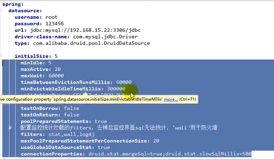


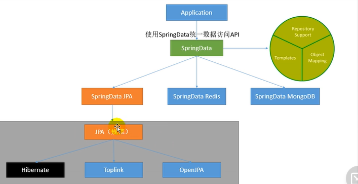


java persistence application

```yam
jpa:
 hibernate:
更新或者创建数据表结构ddl-auto: update控制台显示SQL
 show-sql: true
```


什么是war包

webpack


## 全栈开发

开发环境热部署
在实际的项目开发调试过程中会频繁地修改后台类文件，导致需要重新编译.
重新启动，整个过程非常麻烦，影响开发效率。
Spring Boot提供了spring-boot-devtools组件，使得无须手动重启SpringBoot应用即可重新编译、启动项目，大大缩短编译启动的时间。
devtools会监听classpath下的文件变动，触发Restart类加载器重新加载该类从而实现类文件和属性文件的热部署
并不是所有的更改都需要重启应用(如静态资源、视图模板)，可以通过设置spring.devtools.restart.exclude属性来指定一些文件或目录的修改不用重启应用

```xml
<dependency>
	<groupId>org.springframework.booy</groupId>
    <artifactId>spring-boot-devtools</artifactId>
    <optional>true</optional>
</dependency>
```


```
#热部署生效
spring.devtools.restart.enabled=true
spring.devtoolsrestart.additional-paths=src/main/java
#设cLasspath月灵下的WEB-INF文件夹内容修改不重启
spring.devtools.restart.exclude=static/**
```

- 如果使用了Eclipse，那么在修改完代码并保存之后，项目将自动编译并触发重启，而如果使用了IntelliJ IDEA，还需要配置项目自动编译。

- 打开Settings页面，在左边的菜单栏依次找到Build,Execution,Deployment一Compile，勾选Build project automatically按Ctrl+Shift+Alt+/快捷键调出Maintenance页面，单击Registry，勾选compilerautomake.allow.when.app.running复选框

- 做完这两步配置之后，若开发者再次在IntelliJIDEA中修改代码，则项目会自动重启。


如果请求的是页面和数据，使用@Controller注解即可; 通常Thymeleaf结合 返回的是视图

如果只是请求数据则可以使用@RestController注解。//会转为json格式


@RequestMapping注解包含很多属性参数来定义HTTP的请求映射规则。

- 常用的属性参数如下:
- value: 请求URL的路径，支持URL模板、正则表达式
- method:HTTP请求方法
- consumes: 请求的媒体类型(Content-Type)，如application/jsonproduces:响应的媒体类型
- params，headers:请求的参数及请求头的值

 

@RequestParam将请求参数绑定到控制器的方法参数上，接收的参数来自HTTP请求体或请求url的QueryString，当请求的参数名称与Controller的业务方法参数名称一致时,@RequestParam可以省略

@PathVaraible:用来处理动态的URL，URL的值可以作为控制器中处理方法的参数

@RequestBody接收的参数是来自requestBody中，即请求体。一般用于处理非 Content-Type: application/x-www-form-urlencoded编码格式的数据比如: application/json、application/xml等类型的数据


如果url中的参数名字与参数不一致 就需要@RequestParam(value="nickname",required=false) String name


当参数过多可以使用一个类来传递参数，不过类属性的名字要和url里的参数名字一致 springboot会帮你自动解析


405方法不被允许:比如这个只允许get不允许post


如果前端使用的是json格式传递给后端则后端需要在参数上加上@RequestBody注解

注意在使用json格式的时候 key要用双引号，后面value的值要根据类型写

## 进阶

### 静态资源访问

- 使用IDEA创建Spring Boot项目，:会默认创建出classpath:/static/目录，静态资源一般放在这个目录下即可。
- 如果默认的静态资源过滤策略不能满足开发需求，也可以自定义静态资源过滤策略。
- 在application.properties中直接定义过滤规则和静态资源位置
- spring.mvc.static-path-pattern=/static/**
- spring.web.resources.static-locations=classpath:/static**
- 过滤规则为/static/**，静态资源位置为classpath:/static/


比如我先把jpg放在static目录下

设置spring.mvc.static-path-pattern=/image/**

那么url需要为 /image/xx.jpg


如果自己又创建一个文件夹

spring.web.resources.static-locations=classpath:/static**


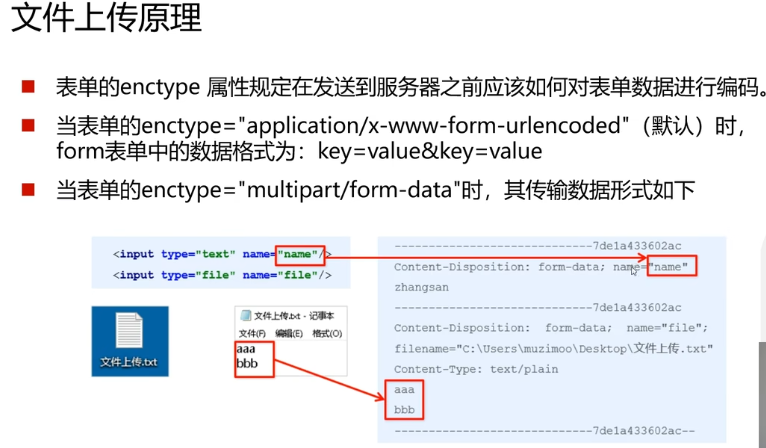


### springboot文件上传

配置

```
spring.servlet.multipart.max-file-size=10MB
spring.servlet.mu1tipart.max-request-size=10MB
```


当表单的enctype="multipart/form-data"时,可以使用MultipartFile 获取上传的文件数据，再通过transferTo方法将其写入到磁盘中

```java
    @PostMapping("/upload")
    public String up(String nickname, MultipartFile photo, HttpServletRequest request)throws IOException
    {
        System.out.println(nickname);
        System.out.println(photo.getOriginalFilename());
        System.out.println(photo.getContentType());
        System.out.println(System.getProperty("user.dir"));

        //获取web服务器中真实的路径
        String path = request.getServletContext().getRealPath("/upload");

        System.out.println(path);
        saveFile(photo,path);
        return "success";
    }
    public void saveFile(MultipartFile photo,String path) throws IOException {
        File dir = new File(path);
        if(!dir.exists())
        {
            dir.mkdir();
        }
        File file = new File(path+photo.getOriginalFilename());
        photo.transferTo(file);

    }
```

idea会自动生成一个文件

如果用户还要访问这个文件则配置以下选项就可以访问

直接访问localhost:8080/a.jpg

```
spring.web.resources.static-location=/upload/
```


### 拦截器

- 拦截器在Web系统中非常常见，对于某些全局统一的操作，我们可以把它提取到拦截器中实现。总结起来，拦截器大致有以下几种使用场景:
- 权限检查:如登录检测，进入处理程序检测是否登录，如果没有，则直接返回登录页面
- 性能监控:有时系统在某段时间莫名其妙很慢，可以通过拦截器在进入处理程序之前记录开始时间，在处理完后记录结束时间，从而得到该请求的处理时间
- 通用行为: 读取cookie得到用户信息并将用户对象放入请求，从而方便后续流程使用，还有提取Locale、Theme信息等，只要是多个处理程序都需要的，即可使用拦截器实现。


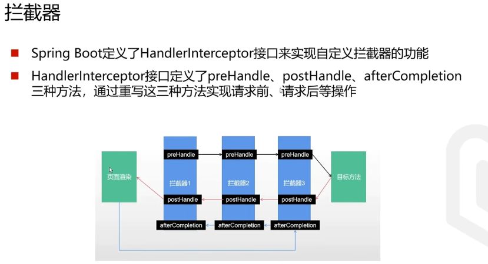


拦截器定义

```
public class LoginInterceptor implements HandlerInterceptor {
    @Override
    public boolean preHandle(HttpServletRequest request, HttpServletResponse response, Object handler) throws Exception {

        System.out.println("logining");
        return true;
    }
}
```


//springboot底层会加载所有WebMvcConfigurer的bean

```
//扩展mvc
@Configuration
public class MyMvcConfig implements WebMvcConfigurer {
    @Override
    public void addViewControllers(ViewControllerRegistry registry) {

    }

    @Override
    public void addInterceptors(InterceptorRegistry registry) {
        registry.addInterceptor(new LoginInterceptor());
        //还可以添加格式
        registry.addInterceptor(new LoginInterceptor()).addPathPatterns("/user/**");
    }
}
```


### Restful

RESTful介绍

- RESTful是目前流行的互联网软件服务架构设计风格
- REST (Representational State Transfer，表述性状态转移)一词是由RoyThomas Fielding在2000年的博士论文中提出的，它定义了互联网软件服务的架构原则，如果一个架构符合REST原则，则称之为RESTful架构。
- REST并不是一个标准，它更像一组客户端和服务端交互时的架构理念和设计原则，基于这种架构理念和设计原则的Web API更加简洁，更有层次。

- 每一个URI代表一种资源
- 客户端使用GET、POST、PUT、DELETE四种表示操作方式的动词对服务端资源进行操作:GET用于获取资源，POST用于新建资源(也可以用于更新资源)PUT用于更新资源，DELETE用于删除资源
- 通过操作资源的表现形式来实现服务端请求操作资源的表现形式是JSON或者HTML。
- 客户端与服务端之间的交互在请求之间是无状态的，从客户端到服务端的每个请求都包含必需的信息。


HTTP状态码

HTTP定义了40个标准状态码，可用于传达客户端请求的结果。状态码分为以下5个类别:
1xx:信息，通信传输协议级信息
2xx:成功，表示客户端的请求已成功接受
3xx:重定向，表示客户端必须执行一些其他操作才能完成其请求4xx:客户端错误，此类错误状态码指向客户端
5xx:服务器错误，服务器负责这写错误状态码


```java
@RestController
public class UserController{
	@GetMapping("/user/{id}")
    public String get(@PathVariable int id)
    {
        //一定要加PathVariable
	}
}
```


### swagger

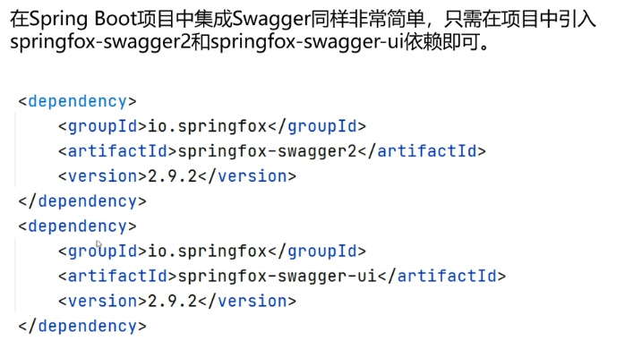


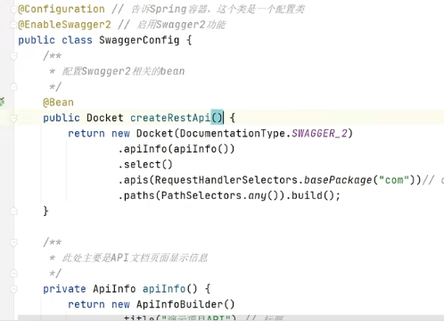


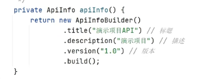


8080/swagger-ui.html

类似aipfox的功能


### 数据库

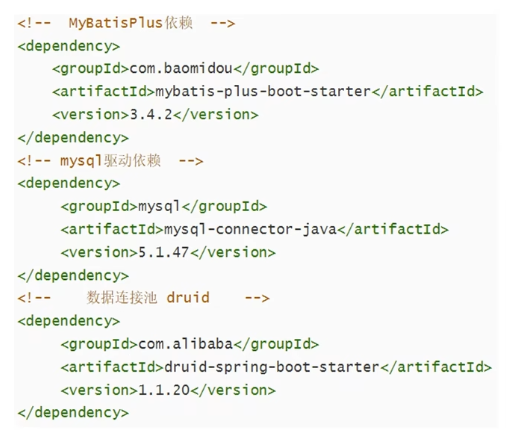


### NodeJS

node.js是一个基于Chrome V8引擎的js运行时环境

里面有NPM node Package manager

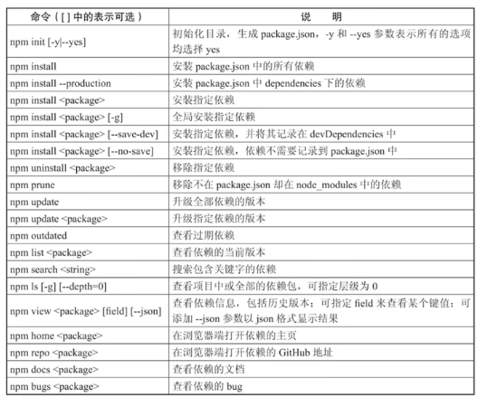


### element ui


### Axions

Axios简介

- 前端页面所需要的数据往往需要从服务器端获取，这必然在实际项目开发中，涉及与服务器的通信
- Axios 是一个基于promise 网络请求库，作用于nodejs 和浏览器中
- Axios在浏览器端使用XMLHttpRequests发送网络请求，并能自动完成JSON数据的转换。
- 安装:npminstallaxios
- 地址: https://www.axios-http.cn/


```js
axios.get('/user/12').
then(function(response)
{
	//处理成功情况
})
.catch(function(err){
	///处理错位
})
.then(function()
     {
    总会执行
})

axios.get('/user'，{
          params:{
          id:123,
          }
          }).
then(function(response)
{
	//处理成功情况
})
.catch(function(err){
	///处理错位
})
.then(function()
     {
    总会执行
})
```


```js
async/await

同步
```


```js
axions({

})
```


### 跨域

为什么会出现跨域问题

- 为了保证浏览器的安全，不同源的客户端脚本在没有明确授权的情况下，不能读写对方资源，称为同源策略，同源策略是浏览器安全的基石
- 同源策略(Sameoriginpolicy) 是一种约定，它是浏览器最核心也最基本的安全功能
- 所谓同源就是两个页面具有相同的协议 (protocol) (即指在同一个域)主机(host)和端口号(port)
- 当一个请求url的协议、域名、端口三者之间任意一个与当前页面url不同即为跨域，此时无法读取非同源网页的 Cookie，无法向非同源地址发送AJAX 请求

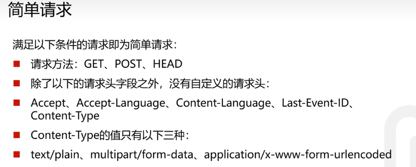


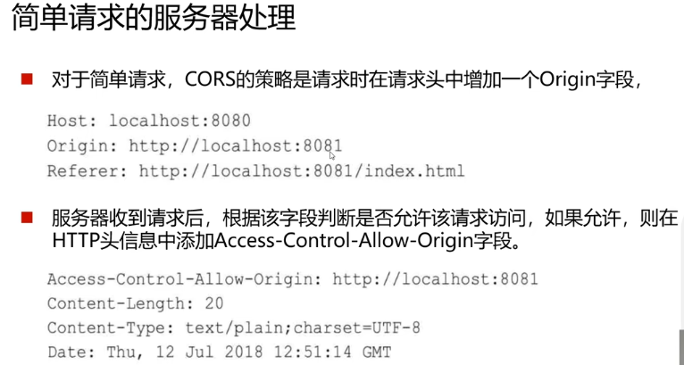

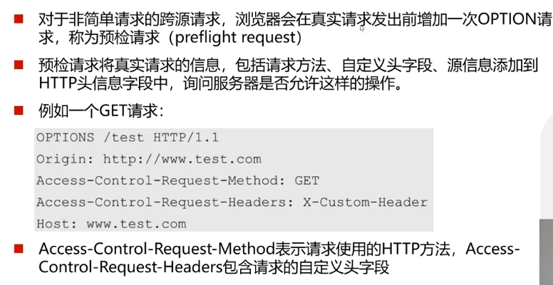

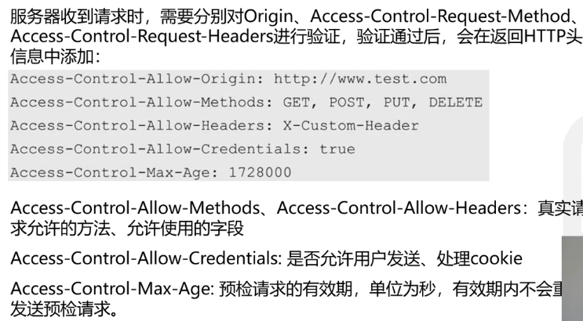


全局

```java

public class MyMvcConfig implements WebMvcConfigurer {

    @Override
    public void addCorsMappings(CorsRegistry registry) {
        registry.addMapping("/**")//允许跨域访问的路径
                .allowedOrigins("*")//语序跨域访问的源
                .allowedMethods("POST","GET")// 允许请求方法
                .maxAge(16800)//预检间隔事件
                .allowedHeaders("*")//允许头部设置
                .allowCredentials(true);//是否发送cookie
    }
}
```


局部

```
@RestController
@CrossOrigin
```


解决this不能指向vm的问题，箭头函数的this指向父亲

```
create:function()
{
	axios.get("http://localhost:8088/user/findAll").then((res)=>{
	this.tableData = res.data
	})
}
```


```js
axios.defaults.baseURL = 'http://localhost:8088'
// 将axios作为全局的自定义属性，每个组件可以在内部直接访问 (Vue3)
app.config.globalProperties.$http = axios
// 将axios作为全局的自定义属性，每个组件可以在内部直接访问 (Vue2)
Vue.prototype.$http = axios
```


```js
create:function()
{
	this.$http.get("http://localhost:8088/user/findAll").then((res)=>{
	this.tableData = res.data
	})
}
```

### VueRouter安装与使用

- Vue路由vue-router是官方的路由插件，能够轻松的管理SPA 项目中组件的切换。
- Vue的单页面应用是基于路由和组件的，路由用于设定访问路径，并将路径和组件映射起来
- vue-router 目前有 3.的版本和4.x 的版本，vue-router 3.x 只能结合 vue2进行使用，vue-router 4.x 只能结合 vue3 进行使用
- 安装:npminstall vue-router@4


可以使用 <router-1ink> 标签来声明路由链接，并使用 <router-view >标签来声明路由占位符示例代码如下

App.vue

```vue
<tenplate>
	<div>
		<h1>App</h1>
			<!-- 声明路由链接 -->
        <router-link to="/discover">发现</router-link>
        <router-link to="/my">我的音乐</router-link>
        <router-1ink to="/friend">关注</router-1ink>
         <!-- 声明路由占位标签  当上面的组件调用时，下面的router-view就会被替换该组件-->
         <router-view></router-view>
	</div>
</template>
```


创建src/router/index.js

```js
import VueRouter from 'vue-router'
import Vue from 'vue"
import Discover from "@/components/Discover.vue"
import Friends from "@/components/Friends.vue"
import My from"@/components/My.wue"
//将VueRouter设图为vue的插件
vue.use(vueRouter)
const router = new VueRouter({// 指定hash周性与组件的对应关系
    routes: [
    { path: '/discover'，component; Discover }, 
    {path: "/friends"， component: Friends },
    { path: "/my", component: My }
     ]
})
export default router
```


在app.vue中导入router

```vue
import router from '/router'//index.js可省略

new Vue(
{
	render: h=>h(App),
	router:router// 可直接简写为router
})

```


重定向

```vue
vue.use(vueRouter)
const router = new VueRouter({// 指定hash周性与组件的对应关系
    routes: [
	{path:'/',redirect:"/discover"}
    { path: '/discover'，component; Discover }, 
    {path: "/friends"， component: Friends },
    { path: "/my", component: My }
     ]
})
export default router
```


#### 嵌套路由

discover.vue

```vue
<router-link to="/discover/a"></router-link>
<router-link to="/discover/b"></router-link>
<router-view></router-view>
```

index.js

```
vue.use(vueRouter)
const router = new VueRouter({// 指定hash周性与组件的对应关系
    routes: [
	{path:'/',redirect:"/discover"}
    {path: '/discover'，component; Discover,
    	children:[
    	{path:"a",component:a},
    	{path:"b",component:b}
    	]
    }, 
    {path: "/friends"， component: Friends },
    { path: "/my", component: My }
     ]
})
export default router
```


#### 动态路由

problem：

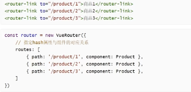

复用性极差

动态路由指的是:把 Hash 地址中可变的部分定义为参数项，从而提高路由规则的复用性，在 ue-router 中使用英文的冒号：来定义
路由的参数项。示例代码如下:

不管id怎么变都会跳到product组件上

index.js

```
{path: "/my/:id',component:Product }
```

my.vue

```vue
<router-link to="/my/1">1</router-link>
<router-link to="/my/2">2</router-link>
<router-view></router-view>
```

product.vue

```vue
<template>
	<p>
        {{$router.params.id}}
    </p>
</template>
<scripts>
	export defalut{
    	props:[id]//还可以这样传参数
    }
</scripts>
```


可以使用编程式实现

```vue
<template>
	<button @click="gotProduct(2)">
       2 
    </button>
</template>

<script>
	export default{
        methos:{
            gotProduct(id)
            {
                this.$router.push('product/${id}')
}
        }
    }
</script>
```


#### 导航守卫

```
router.beforeEach((to，from， next) =>if (to.path === "/main' && !isAuthenticated) (mext('/ogin")
1
else {
next()
}
```


### Vuex

集中存储管理

状态管理

- 每一个Vuex应用的核心都是一个store，与普通的全局对象不同的是，基于Vue数据与视图绑定的特点，当store中的状态发生变化时，与之绑定的视图也会被重新渲染。
- store中的状态不允许被直接修改，改变store中的状态的唯一途径就是显式地提交 (commit) mutation，这可以让我们方便地跟踪每一个状态的变化。
- 在大型复杂应用中，如果无法有效地跟踪到状态的变化，将会对理解和维护代码带来极大的困扰。
- Vuex中有5个重要的概念: State、Getter、 Mutation、Action、Module.


基于vue3

```js
// 创建一个新的 store 实例
const store = createstore({
state(){
    return {
	count: 0
}
},
mutations: {
	increment (state) {state.count++}
}
})
```

每个组件通过this.$store.state.count访问

修改可以直接修改 不过建议使用this.$store.commit(function)


注入

```
new vue{
	store:store
}
```


### mockjs

Mock.js是一款前端开发中拦截Ajax请求再生成随机数据响应的工具，可以用来模拟服务器响应

Mock.mock( rurl?,rtype?, templatelfunction( options ))

rurl，表示需要拦截的 URL，可以是URL 字符串或 URL 正则

rtype，表示需要拦截的 Ajax 请求类型。例如GET、POST、PUT、DELETE等

template，表示数据模板，可以是对象或字符串function，表示用于生成响应数据的函数

设置延时请求到数据


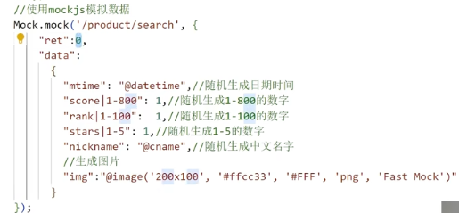


不适用的时候就直接去掉import对代码侵入性小


### vue-element-admin

https://panjiachen.github.io/vue-element-admin-site/zh/guide/

 

@指src目录


### 认证

session认证

- 互联网服务离不开用户认证。一般流程是下面这样
- 用户向服务器发送用户名和密码
- 服务器验证通过后，在当前对话(session)里面保存相关数据，比如用户角色登录时间等。
- 服务器向用户返回一个 session id，写入用户的 Cookie。
- 用户随后的每一次请求，都会通过 Cookie，将 session id 传回服务器
- 服务器收到 session id，找到前期保存的数据，由此得知用户的身份


session 认证的方式应用非常普遍，但也存在一些问题，扩展性不好，如果是服务器集群，或者是跨域的服务导向架构，就要求session 数据共享，每台服务器都能够读取session，针对此种问题一般有两种方案:

- 一种解决方案是session 数据持久化，写入数据库或别的持久层。各种服务收到请求后，都向持久层请求数据。这种方案的优点是架构清晰，缺点是工程量比较大。
- 一种方案是服务器不再保存 session 数据，所有数据都保存在客户端，每次请求都发回服务器。Token认证就是这种方案的一个代表


Token认证

- Token 是在服务端产生的一串字符串,是客户端访问资源接口(API)时所需要的资源凭证，流程如下:
- 客户端使用用户名跟密码请求登录，服务端收到请求，去验证用户名与密码
- 验证成功后，服务端会签发一个 token 并把这个 token 发送给客户端
- 客户端收到 token 以后，会把它存储起来，比如放在 cookie 里或者localStorage 里
  客户端每次向服务端请求资源的时候需要带着服务端签发的 token
- 服务端收到请求，然后去验证客户端请求里面带着的 token，如果验证成功就向客户端返回请求的数据


基于token的用户认证是一种服务端无状态的认证方式，

服务端不用存放token 数据
用解析 token的计算时间换取session的存储空间，从而减轻服务器的压力减少频繁的查询数据库

token 完全由应用管理，所以它可以避开同源策略


JWT

JSON Web Token (简称JWT) 是一个token的具体实现方式，是目前最流行的跨域认证解决方案。

JWT的原理是，服务器认证以后，生成一个JSON 对象，发回给用户，

具体如

```
{"姓名":"张三",
角色":"管理员",
到期时间":“2018年7月1日0点0分
}
```

用户与服务端通信的时候，都要发回这个JSON对象。服务器完全只靠这个对象认定用户身份

为了防止用户篡改数据，服务器在生成这个对象的时候，会加上签名


JWT的由三个部分组成，依次如下
Header (头部)
Payload(负载)
Signature (签名)

三部分最终组合为完整的字符串，中间使用.分隔，如下

HeaderPayload.Signature

```
eyJhbGciOiJIUzI1NiIsInR5cCI6IkpXVCJ9.
eyJzdWIiOixMjMONTY30DkwIiwibmFtZSI6IkpvaG4gRG9lIiwiaXNTb2NpYWwiOnRydWV9.
44pcPyMD09o1PSyXnrXCjTwXyr4BsezdI1AVTmud2fU4
```

1.Header 部分是一个JSON 对象，描述JWT的元数据
"alg":"HS256"
"typ":"JWT"

alg属性表示签名的算法(algorithm)默认是HMACSHA256(写成HS256)

typ属性表示这个令牌 (token)的类型 (ype)，JWT 令牌统一写为JWT最后，将上面的JSON 对象使用 Base64URL算法转成字符串。


2.Payload 部分也是一个JSON 对象，用来存放实际需要传递的数据。JWT 规定了7个官方字段，供选用。

```
iss (issuer): 签发人
exp (expiration time):过期时间
sub (subject): 主题
aud(audience):受众
nbf(Not Before): 生效时间
iat(lssued At): 签发时间
jti (WT ID): 编号
```

注意，JWT 默认是不加密的，任何人都可以读到，所以不要把秘密信息放在这个部分。

这个JSON 对象也要使用 Base64URL 算法转成字符串


3.Signature部分是对前两部分的签名，防止数据篡改首先，需要指定一个密钥(secret) 。这个密钥只有服务器才知道，不能泄露给用户，然后，使用 Header 里面指定的签名算法(默认是HMACSHA256)，按照下面的公式产生签名


客户端收到服务器返回的JWT，可以储存在 Cookie 里面，也可以储存在localStorage。
客户端每次与服务器通信，都要带上这个JWT，可以把它放在 Cookie 里面自动发送，但是这样不能跨域。
更好的做法是放在HTTP请求的头信息Authorization字段里面，单独发送


```xml
<dependency>
    <groupId>io.jsonwebtoken</groupId>
    <artifactId>jjwt</artifactId>
    <version>0.9.1</version>
</dependency>
```


生成token

```java
//7天过期
private static Long expire = 604800;
//32位秘钥
private static String secret = "abcdfghiabcdfghiabcdfghiabcdfghi";
//生成token
public static String generateToken(String username){
    Date now = new Date();
	Date expiration = new Date(now.getTime() + 100 * expire);
    return Jwts.builder().setHeaderParam( "type", "JWT")
						 .setSubject(username)
						 .setIssuedAt(now)
        				 .setExpiration(expiration)    				   
        				 .signwith(SignatureAlgorithm.HS512,secret)
        				 .compact();
}
```

解析Token

```java
public static Claims getClaimsByToken(String token)
{
    return Jwts.parser()
        .setSigningKey(secret)
        .parseClaimsJws(token)
        .getBody();
}
```


返回结果可以封装为一个对象

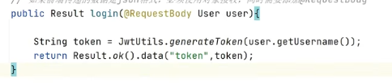


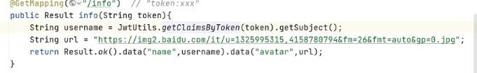


## 部署

云服务器(Elastic Compute Service, ECS)是一种简单高效、安全可靠、处理能力可弹性伸缩的计算服务。其管理方式比物理服务器更简单高效。


